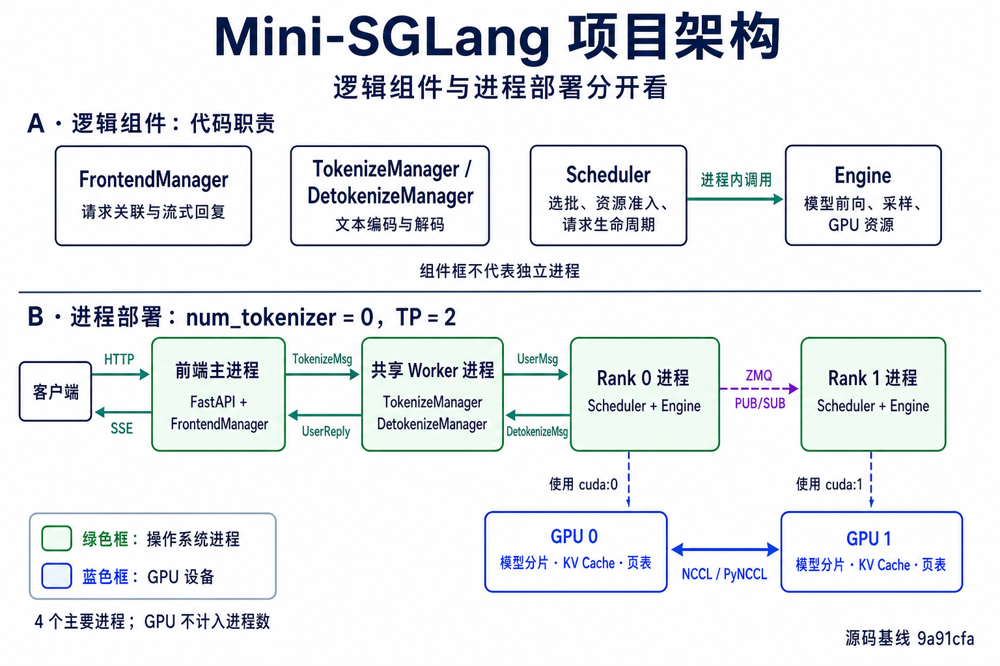
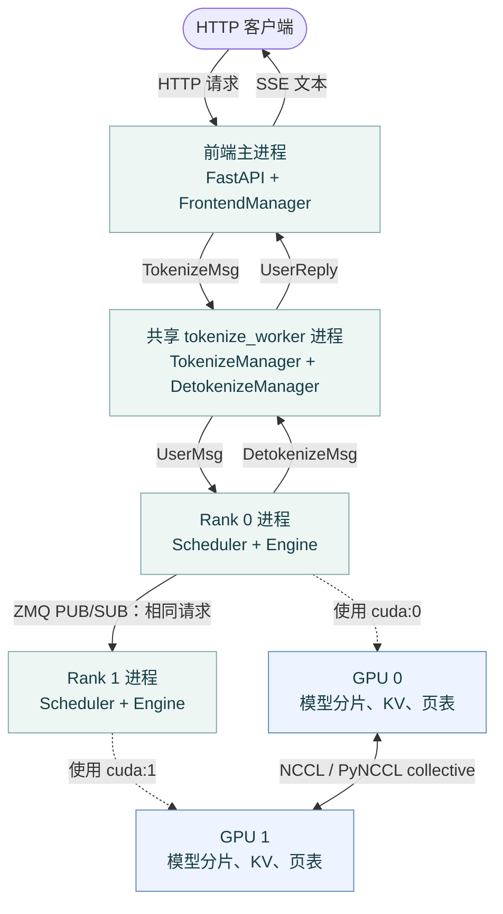
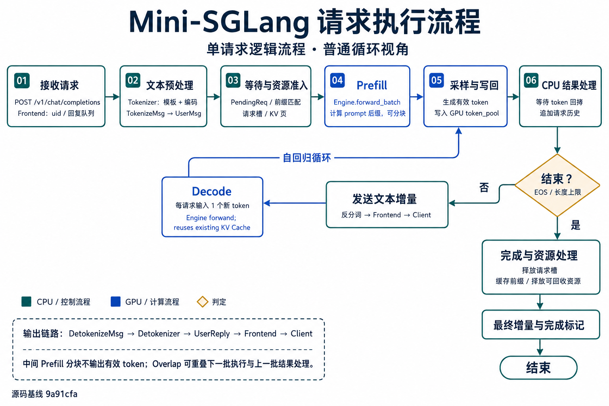
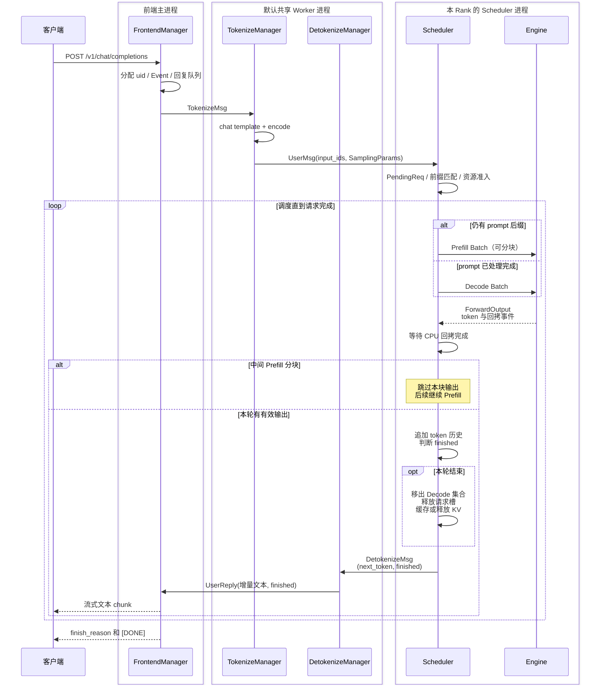
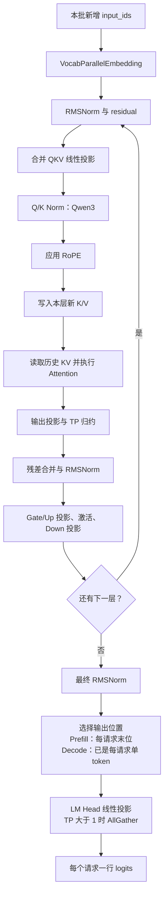

# Mini-SGLang 源码学习指南

> 从一次请求出发，理解大模型推理框架如何组织计算、管理显存、复用前缀，并让 CPU 与 GPU 协同工作。

本文面向熟悉 Python、了解 PyTorch 张量和 Transformer 基本结构的读者。遇到推理系统特有的概念，会先解释问题，再对应到实现。建议把本文与源码并排阅读。

**分析基线**：本地提交 `9a91cfafe754aa85daee49998176275667eb58f2`，短提交号 `9a91cfa`；整理日期为 2026-09-07。除明确标注的原理资料外，项目行为均以这个版本的本地源码为依据。

**验证范围**：本次环境为 macOS / arm64，默认 Python 3.14.5，未安装 PyTorch、FlashInfer、Transformers、TVM-FFI 和 pytest。本次完成源码阅读与文档静态检查，未运行模型推理、CUDA 测试或性能基准。下文运行命令是面向 Linux + NVIDIA GPU 的复现步骤，不代表已经在本机验证通过。

## 目录

1. [项目定位与学习价值](#01-overview)
2. [先建立推理的基本模型](#02-basics)
3. [源码地图与推荐阅读顺序](#03-map)
4. [进程架构与启动过程](#04-architecture)
5. [一次请求的完整生命周期](#05-lifecycle)
6. [核心数据结构与批次布局](#06-data)
7. [调度与 Chunked Prefill](#07-scheduling)
8. [KV Cache 的物理存储与分页](#08-kv)
9. [Radix Cache 的匹配、保护与淘汰](#09-radix)
10. [模型执行、权重加载与算子](#10-model)
11. [Attention 后端与元数据](#11-attention)
12. [Tensor Parallelism](#12-tp)
13. [CUDA Graph](#13-graph)
14. [Overlap Scheduling](#14-overlap)
15. [MoE 与自定义 Kernel](#15-moe-kernel)
16. [API、采样与能力边界](#16-api)
17. [运行指南与参数速查](#17-running)
18. [实验、测试与性能分析](#18-experiments)
19. [工程边界与扩展练习](#19-extension)
20. [分阶段学习计划与自测](#20-study)
21. [术语与源码导航](#21-index)

<a id="01-overview"></a>
## 1. 项目定位与学习价值

Mini-SGLang 是一个面向大语言模型的精简推理框架：它加载预训练权重，接收多个生成请求，将请求组织成 GPU 批次，持续生成 token，并通过 HTTP 或离线 Python 接口返回文本。

它最值得学习的部分，是把“Transformer 的一次前向计算”组织成“能持续处理请求的推理服务”。模型层回答怎样计算；调度器回答现在算谁；缓存管理器回答历史状态放在哪里、何时复用与释放。

### 1.1 能力概览

| 能力 | 解决的问题 | 主要源码 |
| --- | --- | --- |
| 在线服务 | 将文本生成包装为 HTTP 与流式输出 | [server/api_server.py](../python/minisgl/server/api_server.py) |
| 连续批处理 | 请求动态加入、结束，更新后续计算批次 | [scheduler/scheduler.py](../python/minisgl/scheduler/scheduler.py) |
| Chunked Prefill | 将长输入的计算拆成多个有预算限制的批次 | [scheduler/prefill.py](../python/minisgl/scheduler/prefill.py) |
| 分页 KV Cache | 给不同长度的请求分配不连续的物理 KV 空间 | [scheduler/cache.py](../python/minisgl/scheduler/cache.py) |
| Radix 前缀复用 | 相同 token 前缀共享已经算好的 K/V | [kvcache/radix_cache.py](../python/minisgl/kvcache/radix_cache.py) |
| 张量并行 | 将单个模型的部分权重和计算分散到多张 GPU | [layers/linear.py](../python/minisgl/layers/linear.py) |
| CUDA Graph | 减少 Decode 阶段重复提交 GPU 算子的开销 | [engine/graph.py](../python/minisgl/engine/graph.py) |
| CPU/GPU 重叠 | GPU 执行时，CPU 继续准备批次、处理上一批结果 | [scheduler/scheduler.py](../python/minisgl/scheduler/scheduler.py) |
| Attention / MoE 后端 | 调用适合推理的高效实现 | [attention](../python/minisgl/attention)、[moe](../python/minisgl/moe) |

这里的“精简”指工程范围和代码组织。当前快照的 `python/minisgl` 有 **90 个 Python 文件、8,095 个物理行**，包含空行和注释，不包含测试、benchmark 与 C++/CUDA 文件。README 的“约 5,000 行”是项目介绍口径，不能直接当作当前版本的精确统计。

### 1.2 需要区分的几个层次

- **Transformer 推理**：根据已有 token 计算下一 token 的概率分布。
- **推理引擎**：管理权重、设备、KV 存储、Attention 后端和前向执行。
- **推理调度**：管理等待与运行中的请求，决定一个批次包括哪些计算。
- **推理服务**：增加协议、分词、请求取消、进程通信和流式响应。

Mini-SGLang 覆盖这四层，但没有实现完整 SGLang 的全部功能。SGLang 原论文还讨论前端语言、结构化生成等内容，不能因为项目名相近就认为此仓库也包含这些功能。[SGLang 原论文](https://arxiv.org/abs/2312.07104)

<a id="02-basics"></a>
## 2. 先建立推理的基本模型

### 2.1 生成过程是自回归的

给定 prompt token：

```text
[x0, x1, x2, x3]
```

模型先处理 prompt，得到第一个生成 token `y0`；再把 `y0` 作为新输入，生成 `y1`，如此循环：

```text
处理 x0 x1 x2 x3  →  y0
处理 y0，读取已有历史 K/V  →  y1
处理 y1，读取已有历史 K/V  →  y2
```

**生成一个 token 和计算这个 token 自己的 K/V，是两件事。** 例如第一轮输出了 `y0`，这一轮产生的是 prompt 的 K/V；`y0` 的 K/V 要在下一轮把 `y0` 输入模型时才产生。理解这一点，才能看懂 `cached_len` 与 `device_len` 为什么通常相差 1。

### 2.2 Prefill 与 Decode

| 项目 | Prefill | Decode |
| --- | --- | --- |
| 输入 | 尚未计算 K/V 的 prompt 后缀或其中一个分块 | 每个请求通常 1 个新 token |
| 是否读取历史 K/V | 前缀命中或后续分块时会读取 | 会读取 |
| 有效生成输出 | 最后一块 prompt 完成后得到第一个生成 token | 每轮得到下一个生成 token |
| 单请求本轮 token 数 | 可以较多 | 通常为 1 |
| 本项目是否使用 CUDA Graph | 否 | 满足捕获批大小范围时使用 |

Prefill 通常有更大的矩阵乘法规模；低并发 Decode 常受权重/KV 访存和 CPU 提交开销影响。但瓶颈会随模型、批大小、上下文长度、硬件及并行方式变化，不能把所有 Prefill 都认定为计算瓶颈、所有 Decode 都认定为访存瓶颈。

### 2.3 KV Cache 究竟缓存什么

一层 Attention 的概念表达式是：

```text
Q = X Wq
K = X Wk
V = X Wv
Attention(Q, K, V) = softmax(Q Kᵀ / sqrt(head_dim) + causal_mask) V
```

对于固定模型和相同上下文前缀，已经计算过的历史 K/V 可以继续用于后续生成。这样每一轮只为新输入计算新的 Q/K/V，同时读取历史 K/V。

KV Cache 不等于最终回答缓存，也不等于完整 hidden states 缓存。它避免重复计算历史 token 的状态，但新 token 的 Attention 仍然要访问允许关注的历史内容。

### 2.4 三种容易混淆的优化

| 优化 | 主要改变什么 | 没有自动解决什么 |
| --- | --- | --- |
| KV Cache | 请求内复用历史 K/V | 不自动复用另一请求的相同前缀 |
| 分页管理 | 逻辑 token 到物理 KV 位置的映射 | 不自动发现相同 token 前缀 |
| Radix Cache | 跨请求发现并共享相同前缀的 KV 位置 | 不把尚未执行的 token 变成有效缓存 |

分页思想可以结合 [PagedAttention 原论文](https://arxiv.org/abs/2309.06180) 理解；本文后续描述的是 Mini-SGLang 自己的表结构与分配逻辑。

<a id="03-map"></a>
## 3. 源码地图与推荐阅读顺序

### 3.1 目录职责

```text
mini-sglang/
├── python/minisgl/
│   ├── core.py          请求、批次、采样参数与全局执行上下文
│   ├── server/          命令行、进程启动、HTTP 与终端交互
│   ├── message/         跨进程消息及序列化
│   ├── tokenizer/       文本到 token、token 到增量文本
│   ├── scheduler/       Prefill/Decode 调度、请求表、KV 分配
│   ├── engine/          模型执行、CUDA Graph、采样
│   ├── models/          模型结构、配置归一化、权重加载
│   ├── layers/          线性层、Embedding、Norm、RoPE、Attention、MoE
│   ├── attention/       FlashAttention、FlashInfer、TRT-LLM 适配
│   ├── kvcache/         KV 存储池、前缀缓存接口与 Radix 树
│   ├── distributed/     TP 信息与 collective 通信接口
│   ├── moe/             专家选择、分组和专家计算流程
│   ├── kernel/          TVM-FFI、CUDA/C++ 和 Triton 实现
│   ├── llm/             离线 Python 生成接口
│   └── benchmark/       在线请求生成、指标处理、kernel 计时工具
├── benchmark/           可直接阅读或运行的基准脚本
├── tests/               分配回归测试、通信与算子检查等
├── docs/                说明文档
├── pyproject.toml       包结构、依赖和开发工具配置
└── Dockerfile           Linux CUDA 容器构建流程
```

### 3.2 第一遍阅读建议

建议依次阅读以下主线，每一步只解决一个问题：

| 顺序 | 文件/入口 | 要回答的问题 |
| --- | --- | --- |
| 1 | [core.py](../python/minisgl/core.py) | 一个请求和一个批次如何表示？ |
| 2 | [llm/llm.py](../python/minisgl/llm/llm.py) | 不经过 HTTP 时，怎样把 prompt 送进调度器？ |
| 3 | [scheduler/scheduler.py](../python/minisgl/scheduler/scheduler.py) | 接收、选批、执行、收尾如何串联？ |
| 4 | [scheduler/prefill.py](../python/minisgl/scheduler/prefill.py)、[decode.py](../python/minisgl/scheduler/decode.py) | 什么请求现在可以执行？ |
| 5 | [engine/engine.py](../python/minisgl/engine/engine.py) | 一个批次如何变成 logits 和 token？ |
| 6 | [models/qwen3.py](../python/minisgl/models/qwen3.py) | 已熟悉的 Transformer 如何接入引擎？ |
| 7 | [scheduler/cache.py](../python/minisgl/scheduler/cache.py)、[kvcache/radix_cache.py](../python/minisgl/kvcache/radix_cache.py) | 历史 K/V 怎么共享和释放？ |
| 8 | [engine/graph.py](../python/minisgl/engine/graph.py)、`overlap_loop()` | 执行开销如何被压缩或隐藏？ |
| 9 | [server/launch.py](../python/minisgl/server/launch.py)、[api_server.py](../python/minisgl/server/api_server.py) | 最后怎样包装成多进程在线服务？ |

第一遍先按 `normal_loop()` 理解同步执行，再读 `overlap_loop()`。这样可以把调度语义与异步状态管理分开理解。

<a id="04-architecture"></a>
## 4. 进程架构与启动过程

下图分成两个视图：**A 展示逻辑组件的职责，B 展示 `num_tokenizer=0`、TP=2 时的进程部署与通信。** 每个 Rank 的 Engine 属于对应 Scheduler 进程；GPU 单独画在进程框外，模型分片和 KV Cache 驻留在设备显存中。



先用 A 理解各组件做什么，再在 B 中沿箭头跟踪进程间消息、Rank 间请求广播与 GPU collective。分词与反分词默认共用一个 worker；两个 Manager 没有彼此直接发送消息。进程到 GPU 的虚线表示使用设备，不是额外的消息通道。

### 4.1 逻辑组件和物理进程要分开看

**组件、进程和设备是三个层次。** `Scheduler`、`Engine`、`FrontendManager` 是代码对象；`mp.Process(...)` 才创建独立的操作系统进程；GPU 是这些进程使用的计算设备。

| 逻辑组件或资源 | 默认运行位置 | 关键区别 |
| --- | --- | --- |
| FastAPI 路由、`FrontendManager` | 同一个前端主进程 | HTTP 路由调用 Manager，回复监听是该进程内的异步任务 |
| `TokenizeManager`、`DetokenizeManager` | 同一个 `tokenize_worker` 进程 | 统一收件循环按消息类型调用两种 Manager |
| `Scheduler`、`Engine` 和调度相关 Manager | 每个 TP Rank 的 Scheduler 进程 | `Scheduler.__init__()` 创建自己的 `Engine`，没有额外的 Engine 进程 |
| 模型权重分片、KV Cache、`page_table` | 对应 Rank 的 GPU 显存 | 设备资源由该 Rank 的 Engine 初始化，GPU 本身不计入进程数 |

下面画出 **`num_tokenizer=0`、TP=2** 时的四个主要进程。每个绿色方框代表一个进程，框内列出主要组件；蓝色方框代表 GPU 设备资源。实线按标签区分消息与 GPU collective，虚线表示进程使用设备。



**默认 `num_tokenizer=0` 时，分词与反分词共用同一个 worker 进程、同一个收件地址。** `zmq_tokenizer_addr` 与 `zmq_detokenizer_addr` 相同。实际 ZMQ 收发发生在 `tokenize_worker()` 的循环中，两个 Manager 负责文本转换，彼此没有直接消息通道。

Rank 0 接收外部请求，再把相同请求消息广播给其他 TP Rank；各 Rank 执行对应的模型分片，只有 Rank 0 向 worker 发送 `DetokenizeMsg`。GPU collective 与这条 CPU 消息链是不同的通信路径。

当 `--num-tokenizer N` 且 `N > 0` 时，启动 N 个分词 worker 和 1 个反分词 worker。每个 worker 的函数实现都创建了两个 Manager，实际处理哪类消息由所连接的队列决定。

主工作进程数量可以按下式理解，不包含可能由依赖产生的辅助进程：

```text
默认配置：1 个前端 + TP 个 Scheduler + 1 个共享 Tokenizer/Detokenizer
独立分词：1 个前端 + TP 个 Scheduler + N 个 Tokenizer + 1 个 Detokenizer
```

依据：[server/args.py](../python/minisgl/server/args.py) 的地址属性、[server/launch.py](../python/minisgl/server/launch.py) 的进程创建、[tokenizer/server.py](../python/minisgl/tokenizer/server.py) 的消息分发、[scheduler/io.py](../python/minisgl/scheduler/io.py) 的 Rank 0 收发，以及 [scheduler/scheduler.py](../python/minisgl/scheduler/scheduler.py) 的 Engine 构造。

### 4.2 进程消息、CPU 协调与 GPU 通信

| 通信方式 | 在当前实现中的作用 |
| --- | --- |
| ZMQ PUSH/PULL | 前端、分词 worker、主调度器之间传递请求和结果 |
| ZMQ PUB/SUB | Rank 0 向其他 TP Rank 转发相同的请求消息 |
| Gloo CPU ProcessGroup | 初始化协调、barrier、消息数量广播、显存统计等 |
| NCCL / 自定义 PyNCCL | 模型执行中的 GPU AllReduce、AllGather |

消息先通过 [message/utils.py](../python/minisgl/message/utils.py) 变成带 `__type__` 的结构，再由 [utils/mp.py](../python/minisgl/utils/mp.py) 使用 msgpack 编码。这里没有把全部 GPU 张量序列化进 ZMQ；传输的是控制信息、CPU 输入 token 与输出 token 等小消息。

### 4.3 启动调用链

```text
python -m minisgl
  → __main__.py
  → launch_server()
  → parse_args()
  → run_api_server()
  → 创建前端 ZMQ 队列
  → start_subprocess()
      → spawn 各 TP Scheduler
      → spawn Tokenizer/Detokenizer
      → 等待 worker 就绪确认
  → 启动 uvicorn 或进入 shell()
```

每个 Scheduler 构造自己的 Engine。Engine 要先完成权重、通信、KV 池、Attention 后端和图捕获初始化，才能报告就绪。

TP worker 会先一起完成 barrier，随后只由 Rank 0 发 Scheduler 的 ready 确认。因此等待确认数量是 `num_tokenizers + 2`，并不是 `TP + num_tokenizers + 1`。

当前启动方式通过本地多进程、`ipc:///tmp/...` 和 `127.0.0.1` 分布式地址连接，定位是**单机多 GPU TP**；没有现成的多节点启动编排。

<a id="05-lifecycle"></a>
## 5. 一次请求的完整生命周期

下图从单请求的普通循环视角，串起输入预处理、Prefill、采样、Decode 循环和完成后的资源处理。蓝色回路表明后续生成复用历史 KV，继续执行 Decode。



图中的“结束”条件包括长度上限，以及未配置忽略 EOS 时遇到 EOS。中间 Prefill 分块不发送有效 token；实际多请求组批和 Overlap 的交错方式，分别见第 7、14 章。

### 5.1 在线调用时序



这是普通循环中的单请求逻辑时序，TP 场景按 Rank 0 的对外收发视角绘制。为突出文本转换职责，图中将消息端点写在两个 Manager 上；实际 ZMQ 收发由它们所在的 `tokenize_worker()` 循环完成。默认两种 Manager 位于同一进程，Scheduler 与 Engine 也位于同一进程。

注意终止顺序：`_process_last_data()` 先判定完成并清理请求资源，再发送带 `finished=True` 的最后一条 `DetokenizeMsg`。中间 Prefill 分块会跳过有效输出路径。真实实现还支持多请求组批，以及下一批执行和上一批结果处理的重叠。

### 5.2 六个可以跟踪的关键点

1. **接收请求**：`v1_completions()` 创建 `TokenizeMsg`。`uid` 用来跨进程关联输入、输出和取消消息。
2. **文本预处理**：`TokenizeManager.tokenize()` 对消息列表应用 chat template，再编码成 CPU 一维 `int32` token 张量。直接传字符串则直接编码。
3. **进入等待队列**：`Scheduler._process_one_msg()` 检查序列长度，将 `UserMsg` 包装成 `PendingReq` 放入 Prefill 队列。
4. **选批并执行**：调度器选择 Prefill 或 Decode，分配页、准备位置和 Attention 元数据，然后调用 Engine。
5. **处理本轮结果**：GPU 上的新 token 写入 `token_pool`，供后续轮次使用；CPU 等待结果回拷，跳过中间 Prefill 分块的输出，对有效输出追加请求历史。
6. **终止判定与回复**：达到长度限制或遇到未忽略的 EOS 时，先从 Decode 集合移除并释放请求槽、处理前缀缓存，再发送带完成标记的 `DetokenizeMsg`；未结束则发送本轮结果，后续继续 Decode。

### 5.3 离线入口为什么值得先读

[LLM](../python/minisgl/llm/llm.py) 直接继承 `Scheduler`，设置 `offline_mode=True`，替换消息接收与发送方法：

```text
LLM.generate()
  → pending_requests
  → offline_receive_msg() 生成 UserMsg
  → 同一套 Scheduler / Engine / KV Cache
  → offline_send_result() 累积 output_ids
  → tokenizer.decode() 返回 text 和 token_ids
```

它没有走 HTTP 和独立分词进程，但保留了核心推理调度。当前 `LLM` 固定构造 `DistributedInfo(0, 1)`，因此该 Python 离线接口是单 Rank 入口。

### 5.4 取消请求的路径

流式客户端断开时，前端尝试发送 `AbortMsg`，worker 将其转换为 `AbortBackendMsg`。调度器先在 Prefill 队列查找，再在 Decode 集合查找；找到已经持有资源的请求后释放资源。

取消与异步在途批次会发生交错。读这条路径时应同时检查 `abort_user()`、`abort_req()`、`_process_last_data()`，不能只看到队列里删除了请求，就认为所有状态都已经完成清理。相关边界列在第 19 节。

<a id="06-data"></a>
## 6. 核心数据结构与批次布局

### 6.1 `Req`：一个请求的执行状态

依据：[core.py](../python/minisgl/core.py) 的 `Req`。

| 字段/属性 | 含义 |
| --- | --- |
| `uid` | 对外请求 ID，关联跨进程消息 |
| `table_idx` | 请求在 GPU 请求表中的行号，与 uid 不同 |
| `input_ids` | CPU 侧 token 历史，结果回传时增长 |
| `cached_len` | 调度状态认为已经安排计算 K/V 的前缀长度 |
| `device_len` | GPU token 序列的逻辑长度；前向前表示本轮输入结束位置 |
| `output_len` | 请求计划允许的生成长度 |
| `max_device_len` | 创建普通 Req 时的输入长度 + 输出预算 |
| `extend_len` | `device_len - cached_len`，本轮需新计算的 token 数 |
| `remain_len` | `max_device_len - device_len` |
| `cache_handle` | 已持有的共享前缀句柄；它的长度不必等于 `req.cached_len` |
| `sampling_params` | 温度、top-k、top-p、EOS 与最大输出数 |

异步执行下，`cached_len` 是由 CPU 提前推进的逻辑状态，不意味着那一刻 GPU 已经物理完成写入。真正的数据依赖由 CUDA stream 顺序和 event 保证。

### 6.2 四个 token 输入，最多生成三个 token

先忽略分块、EOS 和 overlap，设原始输入长度为 4，输出预算为 3：

| 时刻 | CPU 历史长度 | `cached_len` | `device_len` | `remain_len` | 本轮输入/结果 |
| --- | --- | --- | --- | --- | --- |
| Prefill 前 | 4 | 0 | 4 | 3 | 输入 4 个 prompt token |
| Prefill 前向提交后、CPU 收尾前 | 4 | 4 | 5 | 2 | `y0` 已安排产生并写入 GPU token 池 |
| Prefill CPU 收尾后 | 5 | 4 | 5 | 2 | CPU 追加 `y0` |
| 第一次 Decode 收尾后 | 6 | 5 | 6 | 1 | 输入 `y0`，输出 `y1` |
| 第二次 Decode 收尾后 | 7 | 6 | 7 | 0 | 输入 `y1`，输出 `y2`，结束 |

最后一个输出 `y2` 没有再进入模型，因此其 K/V 尚未计算。结束时可有效复用的 KV 前缀长度是 6，而 CPU token 历史长度是 7。

`complete_one()` 只做两步：把 `cached_len` 设为旧 `device_len`，然后把 `device_len` 加 1；`append_host()` 则单独追加 CPU token。这一分离是 overlap 能提前调度下一步的基础。

### 6.3 `Batch`：本轮任务与扁平张量

`Batch` 既持有真实请求列表，也持有执行所需的张量：

| 字段 | 用途 |
| --- | --- |
| `reqs` | 真正需要执行的请求 |
| `phase` | `prefill` 或 `decode` |
| `padded_reqs` | 为 CUDA Graph 补齐后包含 dummy request 的列表 |
| `input_ids` | 本轮所有新增输入 token 拼接成的一维张量 |
| `positions` | 每个 token 在自己请求中的绝对位置 |
| `out_loc` | 本轮 K/V 要写入的物理 token 槽位 |
| `attn_metadata` | Attention 后端需要的长度、边界与 KV 索引等信息 |

Prefill 不使用形如 `[batch_size, max_prompt_len]` 的普通 padding 输入。不同请求的新增 token 被拼接，序列边界由元数据描述。

### 6.4 两个请求的扁平化示例

设本轮有：

```text
A：table_idx=2，cached_len=3，device_len=5，新增位置 3、4
B：table_idx=0，cached_len=0，device_len=2，新增位置 0、1
```

则：

```text
请求行映射    = [2, 2, 0, 0]
positions     = [3, 4, 0, 1]
input_ids     = [A3, A4, B0, B1]
out_loc       = page_table[请求行映射, positions]
Q 长度        = [2, 2]
K/V 总长度    = [5, 2]
cu_seqlens_q  = [0, 2, 4]
cu_seqlens_k  = [0, 5, 7]
最后输入索引  = [1, 3]
```

模型为这 4 个新输入计算 hidden states；LM Head 在 Prefill 时只取每个请求最后一个输入位置，也就是索引 1 和 3，产生两行 logits。

不同请求不会因为拼在一个张量里就相互 Attention。请求边界、KV 索引和 causal 语义由后端元数据表达。

### 6.5 `Context` 与共享表

`Context` 保存当前进程的：

- `page_size` 和 `page_table`；
- KV 存储池；
- Attention / MoE 后端；
- 当前激活的 `Batch`。

`with ctx.forward_batch(batch)` 在模型前向期间设置当前批次，退出时清除；不允许嵌套激活。模型和层通过 `get_global_ctx()` 获取位置、KV 和元数据，减少逐层传参。

这是每个进程内的单例，不是跨进程共享的 Python 对象。它也意味着 Engine 初始化有较强的全局状态约束，不能假设同一进程可以任意创建多个独立 Engine。

<a id="07-scheduling"></a>
## 7. 调度与 Chunked Prefill

### 7.1 调度器怎样选下一批

`Scheduler._schedule_next_batch()` 的策略可以概括为：

```text
先尝试 PrefillManager.schedule_next_batch(prefill_budget)
若没有可执行的 Prefill 批次，再尝试 DecodeManager.schedule_next_batch()
```

这带来三个结论：

1. 当前是 **Prefill 优先**；源码还留有支持其他策略的 TODO。
2. 一个 `Batch` 的 phase 只有一种，没有把普通 Prefill 与 Decode 请求混在同一批的实现。
3. Chunked Prefill 限制了单轮新增 token 数，却不保证每个分块之间都插入 Decode。在持续可执行的 Prefill 压力下，已有请求的 Decode 等待时间可能增加。

因此，它借鉴了分块思想，但不能直接等同于 Sarathi-Serve 的完整 stall-free 混合调度策略。[Sarathi-Serve 原论文](https://arxiv.org/abs/2403.02310)

### 7.2 Prefill 准入有三个限制

[PrefillAdder](../python/minisgl/scheduler/prefill.py) 主要检查：

| 限制 | 体现 | 目的 |
| --- | --- | --- |
| 请求槽 | `TableManager.available_size` | 限制同时持有请求行的数量 |
| 本轮计算预算 | `token_budget` | 限制本轮新增 Prefill token 数 |
| KV 容量估算 | `estimated_len + reserved_size` | 给输入后缀和未来输出保留容量余地 |

准入流程是：

```text
检查请求槽
  → 匹配共享前缀
  → estimated_len = 未命中输入长度 + 输出预算
  → 检查可用容量
  → 锁住前缀
  → 再检查可用容量
  → 分配请求行
  → 将命中前缀的 token 与 KV 位置写入该行
```

**为什么锁前缀后再检查一次？** 因为 `available_size` 包含“当前可以淘汰的缓存”。一个前缀在加锁前可能计入可淘汰容量；加锁后变成受保护容量，可用量会下降。

这是资源估算，不是一次性预分配全部输出 KV。实际页分配发生在准备每个执行批次时。

### 7.3 输出预算会影响准入

Decode 的保留量为：

```text
inflight_tokens
  = 所有运行请求的 remain_len 之和
  + (page_size - 1) × 运行请求数
```

第二项为页粒度尾部浪费留出余量。新 Prefill 的估算会叠加这部分保留量。

因此，`max_tokens` 不只是“最多生成多长”，还会影响新请求能否进入运行状态。把每个短请求的输出预算都设置得很大，可能降低准入并发。该策略整体较保守，源码也标注了改进估算的 TODO；不能把它当成所有边界配置下不会 OOM 的数学证明。

### 7.4 等待队列中的队首阻塞

`PrefillManager` 按 `pending_list` 顺序尝试加入请求，一旦一个请求加入失败就 `break`。它不会继续寻找后面更短、更容易容纳的请求。

例如 A 很长、暂时不满足容量估算，而后面的 B 很短，即使 B 单独能够执行，当前这次扫描也不会越过 A。这是分析调度吞吐与公平性时需要注意的行为。

### 7.5 长 prompt 如何分块

设 prompt 长度为 10，无前缀命中，本轮最大新增 Prefill token 预算为 4：

| 批次 | 本轮输入位置 | 请求对象 | 对外输出 |
| --- | --- | --- | --- |
| 1 | 0、1、2、3 | `ChunkedReq` | 不发送生成 token |
| 2 | 4、5、6、7 | `ChunkedReq` | 不发送生成 token |
| 3 | 8、9 | 普通 `Req` | 产生第一个有效生成 token |
| 后续 | 每轮一个新生成 token | 普通 `Req` | 正常 Decode |

中间分块会保留同一个 `table_idx` 和前缀句柄。下一块根据前一块已经推进的 `cached_len` 继续处理原始 prompt。

`ChunkedReq.can_decode` 固定返回 False，避免中间分块进入 Decode 集合；结果处理也会跳过它。一个细节是：当前 Engine 统一执行 LM Head 和采样，中间分块的样本仍可能被算出，但被视为无效结果并丢弃。不要把“不对外生成”误读为“底层完全没有执行采样”。

另外，`--max-prefill-length` 对应的是**整个 Prefill 批次的新增 token 预算**，不只是每个请求单独的 chunk 上限。例如预算 8 时，可以一次加入两个各需 4 个新 token 的请求。

### 7.6 Decode 为什么要按 uid 排序

`DecodeManager.running_reqs` 是一个 `set`，但构造批次时会执行：

```python
sorted(self.running_reqs, key=lambda req: req.uid)
```

不同进程中 Python 对象的哈希/遍历顺序没有跨进程一致性保证。TP 的所有 Rank 必须让批次中第 i 行表示同一个请求，否则模型 collective 即使张量形状一致，也可能混合不同请求的结果。

当前提交的主题正是稳定各 TP Rank 的 Decode 请求顺序。这是一个很好的例子：分布式正确性不仅要求同样的权重划分和通信调用，还要求一致的数据排列。

<a id="08-kv"></a>
## 8. KV Cache 的物理存储与分页

### 8.1 缓存被拆成三个层次

| 层次 | 负责什么 | 不负责什么 |
| --- | --- | --- |
| `MHAKVCache` | 分配和读写真正的 K/V 张量 | 不决定请求何时执行 |
| Scheduler 的 `CacheManager` | 管理空闲页、写请求页表、处理分配与释放 | 不执行 Attention |
| `BasePrefixCache` 的实现 | 根据 token 前缀查找共享位置、保护和淘汰前缀 | 不保存模型权重 |

这种拆分使 `naive` 和 `radix` 可以共用相同的 KV 存储池及页分配逻辑。

### 8.2 KV 张量的形状

[MHAKVCache](../python/minisgl/kvcache/mha_pool.py) 分配：

```text
[2, num_layers, num_pages, page_size, local_kv_heads, head_dim]
```

第一维区分 K 和 V。每一层取出的 K 或 V 形状为：

```text
[num_pages, page_size, local_kv_heads, head_dim]
```

写入时将前两维展平，变成：

```text
[num_pages × page_size, local_kv_heads, head_dim]
```

这样 `out_loc` 中的一个整数就能指定该 token 的物理 K/V 位置。所有层使用一致的 token 位置映射，但各层有各自的 K/V 数据。

Engine 额外分配 **1 个 dummy page**，并额外分配 **1 行 dummy request**，供 CUDA Graph padding 使用。正常分配器只管理真正可用的 `num_pages`，不会把 dummy page 发给真实请求。

### 8.3 `page_table` 保存物理 token 位置

全局页表的形状为：

```text
[max_running_req + 1, align_up_32(max_seq_len)]
```

这里按 32 个 `int32` 元素对齐，对应 128 字节。该表按每个 token 保存一个物理索引：

```text
page_table[请求行号, 请求内的逻辑位置] = KV 池中的物理 token 槽位
```

例如 `page_size=4`，某请求分到了起点为 12 和 28 的两个物理页：

```text
逻辑 token 位置： 0   1   2   3 | 4   5   6   7
物理 token 槽位：12  13  14  15 |28  29  30  31
```

若某个 Attention 后端需要“页号”，则对每页取一个元素，再整除 `page_size`，得到 `[3, 7]`。

此外，`token_pool` 与 `page_table` 形状相同，但存的是**词表中的 token ID**，不是 K/V，也不是物理地址。二者不能混用。

### 8.4 新页何时分配

`CacheManager.allocate_paged()` 对每个请求计算：

```text
first_page = ceil(cached_len / page_size)
last_page  = ceil(device_len / page_size)
needed_pages = last_page - first_page
```

若缓存长度为 5，本轮处理到长度 9，页大小为 4：

```text
已有页覆盖：逻辑位置 0..3、4..7
本轮要补：位置 5、6、7、8
需要新页：只为位置 8 所在的页新增 1 页
```

位置 5、6、7 使用此前分配但尚未写满的尾页，不需要每个 token 都重新分配。

`free_slots` 存储的是**页起点**。例如页大小为 4 时，合法元素是 `0, 4, 8, 12...`。Radix 淘汰返回的则是 token 索引列表，所以回收到空闲页列表时必须使用 `indices[::page_size]`。测试 [test_cache_allocate.py](../tests/core/test_cache_allocate.py) 专门覆盖了淘汰后仍保持页对齐、连续分配不重叠等问题。

### 8.5 空闲容量与可回收容量

当前可用于准入估算的 token 容量是：

```text
available_size
  = 空闲物理页数 × page_size
  + Radix 中允许淘汰的 token 数
```

活跃请求锁住的前缀不能淘汰，因此不包含在第二项中。

请求完成并不意味着其 KV 立即全部回到空闲页列表。若前缀被保留在 Radix 中，它会进入可淘汰状态，等待后续复用或容量不足时回收。

在系统空闲、没有活跃私有 KV 时，`check_integrity()` 检查：

```text
空闲页数 + 前缀缓存占用页数 = 正常物理页总数
```

这一等式不能直接套在仍有活跃请求持有未入树 KV 的时刻。

### 8.6 KV 显存估算

每个 Rank 上，每个物理页的 K+V 字节数为：

```text
bytes_per_page
  = 2
  × num_layers
  × local_kv_heads
  × head_dim
  × page_size
  × dtype_bytes
```

假设单 Rank、32 层、8 个 KV heads、head_dim=128、BF16 每元素 2 字节：

```text
每个 token 的全部层 K/V = 2 × 32 × 8 × 128 × 2
                        = 131,072 bytes
                        = 128 KiB
8,192 个 token 的 K/V   = 1 GiB
```

这是教学用参数组合，不代表仓库默认模型的真实配置。计算时应读取实际 `ModelConfig`。

[Engine._determine_num_pages()](../python/minisgl/engine/engine.py) 的自动估算近似为：

```text
模型相关占用 ≈ 加载前空闲显存 - 加载后空闲显存
KV 可用字节 ≈ memory_ratio × 加载前空闲显存 - 模型相关占用
num_pages   = KV 可用字节 // bytes_per_page
```

因此 `memory_ratio=0.9` 不是把显卡总显存的 90% 全部给 KV；它基于初始化阶段测到的空闲显存，并扣除权重加载等占用。后面还需要为 workspace、请求表、图捕获等留出空间。

Chunked Prefill 主要限制每轮新增计算和临时激活规模。KV 池在启动时已经整体分配，长上下文最终需要的有效 K/V 仍然随长度增长，分块不会让长期 KV 占用凭空消失。

<a id="09-radix"></a>
## 9. Radix Cache 的匹配、保护与淘汰

### 9.1 先看共享前缀的例子

若已经计算过 A，再收到 B：

```text
A = [10, 20, 30, 40]
B = [10, 20, 50]
```

在 `page_size=1` 的示意中，可以形成：

```text
root
 └── [10, 20]
      ├── [30, 40]  → A 后缀的物理 KV 索引
      └── [50]      → B 后缀的物理 KV 索引
```

B 可以复用 `[10, 20]` 对应的 KV，只计算未命中的输入。

复用要求 token 前缀相同。自然语言含义相近、只在中间出现相同片段，或者 chat template 改变导致 token 序列不同，都不能直接共享这段前缀 KV。相同 token 在不同前文或位置下也不能随意复用。

### 9.2 树里保存的是键与索引

`RadixTreeNode` 主要包含：

| 内容 | 实际含义 |
| --- | --- |
| `_key` | 一段 CPU token 序列 |
| `_value` | 这段 token 对应的 KV 物理索引张量 |
| `children` | 按首 token 或首个 page 的 token 组合查找子节点 |
| `_parent` | 父节点 |
| `ref_count` | 有多少活跃引用保护该路径 |
| `timestamp` | 最近访问时更新的时间，用于淘汰排序 |

树是 Python 侧的数据结构；真正 K/V 数据在 GPU 存储池里。`fast_compare_key()` 通过 C++ 在 CPU 上找两个整数张量的最长公共前缀，不是 GPU Attention kernel。

依据：[kvcache/radix_cache.py](../python/minisgl/kvcache/radix_cache.py)、[kernel/csrc/src/radix.cpp](../python/minisgl/kernel/csrc/src/radix.cpp)。

### 9.3 匹配时为什么可能分裂节点

一条边可能存 `[10, 20, 30, 40]`，新请求只有前两个 token 相同。`_tree_walk()` 会把边拆成公共段 `[10, 20]` 与剩余段 `[30, 40]`，让公共段成为可引用的节点。

所以 `match_prefix()` 虽然主要是查询接口，当前实现可能更新访问时间并分裂树节点。抽象接口里“不会修改缓存”的注释不能理解为“Python 树结构绝不会发生变化”；它没有在这个阶段分配新的模型 KV 数据。

### 9.4 为什么匹配时排除最后一个输入 token

`CacheManager.match_req()` 使用：

```python
req.input_ids[: input_len - 1]
```

因为当前系统只复用 K/V，没有缓存可以直接采样的最后位置 logits。至少保留一个输入 token 再执行一次前向，才能得到第一个新输出 token 的概率分布，同时满足 `Req` 初始化时 `cached_len < device_len` 的要求。

加上页对齐后，实际命中还可能更短。例如完整 8-token prompt 的 KV 都在缓存里，页大小为 4：本次最多尝试匹配 7 个 token，最终只能命中 4 个完整 token 页，剩余 4 个 token 仍要执行 Prefill。

### 9.5 锁与解锁保护的是整条前缀路径

拿到 handle 后，沿节点到 root 的路径增加引用计数。当节点从 0 个引用变为 1 个引用时，它的长度从 `evictable_size` 转到 `protected_size`。

解锁时反向移动：节点引用减到 0，才重新允许淘汰。共享前缀如果同时被 A 和 B 使用，A 结束只解除自己的引用，B 仍然保护这段 KV。

这与“某个请求结束后把其页全部 free”有根本差别。缓存回收必须考虑所有使用者。

### 9.6 插入时的四个关键长度

`insert_prefix()` 返回：

```text
cached_len：插入前，树中已经存在的公共前缀长度
handle.cached_len：插入后，本次纳入缓存的完整页前缀长度
```

它们又不同于 `req.cached_len`，后者描述该请求执行进度。还存在 `old_handle.cached_len`，表示该请求先前已经共享的前缀。

`CacheManager.cache_req()` 处理的关键区域是：

| 区域 | 意义 | 处理方式 |
| --- | --- | --- |
| 旧句柄长度 → 插入前已存在长度 | 请求自己分配了 KV，但后来发现树中已有相同前缀 | 释放重复持有的物理位置 |
| 插入前已存在长度 → 新句柄长度 | 新增进入 Radix 的完整页 | 由前缀缓存继续管理 |
| 新句柄长度 → 请求有效 KV 长度 | 不足完整页、未纳入树的尾部 | 运行中保留；结束时释放 |

这一段是理解内存泄漏、重复释放和共享前缀生命周期的核心。读代码时应把四个长度写在纸上，逐个标出区间，避免仅凭变量名猜测。

Prefill 完成的普通请求会先缓存前缀并保持锁定；请求最终结束时再插入更长的有效 KV 前缀并解除活跃保护。中间 `ChunkedReq` 不走普通结果收尾中的前缀插入分支。

### 9.7 淘汰策略

当空闲页不足时：

```text
收集 ref_count=0 的叶节点
  → 按 timestamp 建立最小堆
  → 淘汰最旧的叶节点
  → 父节点若变成未受保护的叶节点，也加入堆
  → 直到释放量达到要求
```

这是一种基于访问时间、受树结构与引用保护约束的 LRU 式策略。淘汰单位是节点，实际释放量可能大于请求量。

`RadixPrefixCache.check_integrity()` 当前为空实现，`reset()` 也未实现。因此外层的页数量检查并不等同于已经严格校验整棵树的引用计数、结构和索引唯一性。

### 9.8 `naive` 模式到底关闭了什么

`--cache-type naive` 让前缀匹配永远返回 0，完成后不保留可复用前缀。请求自身的历史 K/V 和分页存储仍然存在，正常 Decode 仍会复用本请求的历史状态。

所以比较 `naive` 和 `radix`，主要是在比较**跨请求前缀复用与相应管理开销**，不能称为“关闭 KV Cache 与开启 KV Cache”的对比。

<a id="10-model"></a>
## 10. 模型执行、权重加载与算子

### 10.1 Engine 初始化顺序

依据：[engine/engine.py](../python/minisgl/engine/engine.py)。

1. 设置 TP 信息，解析实际 Attention/MoE 后端。
2. 选择 `cuda:rank`，设置随机种子和执行 stream。
3. 初始化进程内 Context 与通信组。
4. 在 `meta` device 上构造模型的权重形状，再加载真实权重。
5. 根据显存估算分配 KV 池。
6. 建立请求页表，限制可接受序列长度。
7. 创建 Attention 后端、必要时创建 MoE 后端、创建采样器。
8. 创建 dummy request，并捕获 Decode CUDA Graph。

Engine 的实际 `max_seq_len` 为配置长度与 KV token 总容量的较小值。调度器后续根据这个值检查输入并限制输出预算。

### 10.2 为什么先用 meta device

模型层在构造时主要创建权重张量的形状。使用 `torch.device('meta')` 可以先建立结构，再由加载流程将真实设备张量替换进去，避免先分配一套无用初始权重。

RoPE 的 sin/cos 表需要真实数值，不能一直留在 meta device。代码用 `set_rope_device()` 和 `get_rope()` 单独处理其生成位置。

### 10.3 `BaseOP` 是项目自己的轻量层基类

多数层继承 [BaseOP](../python/minisgl/layers/base.py)，并非 `torch.nn.Module`。它通过遍历公开属性：

- 找出 Tensor，组织为 `state_dict`；
- 对子 `BaseOP` 递归处理；
- 加载时核对 shape 和 dtype；
- 直接替换权重属性；
- 检查未消费的多余权重键。

`OPList` 提供类似层列表的编号递归；`StateLessOP` 则用于没有需要加载权重的操作。

这是针对推理的轻量实现，不包含完整训练模块体系。增加功能时不能默认所有 `nn.Module` 工具都可直接套用。

### 10.4 Qwen3 的一次模型前向



源码主线：[models/qwen3.py](../python/minisgl/models/qwen3.py) → [models/utils.py](../python/minisgl/models/utils.py) → [layers/attention.py](../python/minisgl/layers/attention.py)。

图中把输出位置选择与词表投影分开画，实际两步都在 [layers/embedding.py](../python/minisgl/layers/embedding.py) 的 `ParallelLMHead.forward()` 内完成。Decoder Layer 会重复执行直到最后一层；TP 词表汇聚发生在投影之后。

### 10.5 张量形状速查

设 `T` 是本轮拼接后的 token 数，`B` 是真实请求数，`H` 是 hidden size，`D` 是 head dim，`Qh/Kh` 是本 Rank 的 Q/KV head 数：

| 位置 | 典型形状 |
| --- | --- |
| 输入 token ID | `[T]` |
| Embedding / hidden states | `[T, H]` |
| 合并 QKV | `[T, (Qh + 2 × Kh) × D]` |
| 送入 Attention 的 Q | `[T, Qh, D]` |
| 本轮 K/V 的逻辑布局 | 各 `[T, Kh, D]` |
| Attention 输出展平 | `[T, Qh × D]` |
| 最后一层输出 | `[T, H]` |
| Prefill 选出的最终位置 | `[B, H]` |
| 全词表 logits | `[B, vocab_size]`，图执行时内部可能含 padding 行 |
| 采样 token | `[B]` |

`RMSNormFused` 把残差相加与 Norm 融合，`GatedMLP` 合并 gate/up 两个投影，减少中间操作与算子提交次数。阅读残差流时同时跟踪 `x` 与 `residual`，不要认为每个 Python 函数都返回已经独立完成残差相加的完整输出。

### 10.6 权重怎样适配运行时结构

[models/weight.py](../python/minisgl/models/weight.py) 的加载流程是：

```text
定位本地目录或下载 safetensors
  → 遍历权重
  → 去除支持的外层 language_model 前缀、跳过视觉相关权重
  → 按 TP Rank 切分
  → 合并 Q/K/V 和 gate/up
  → MoE 时按专家编号堆叠
  → 转为目标 dtype
  → BaseOP.load_state_dict() 校验并替换
```

| checkpoint 结构 | 运行时结构 |
| --- | --- |
| `q_proj`、`k_proj`、`v_proj` | `qkv_proj` |
| `gate_proj`、`up_proj` | `gate_up_proj` |
| `experts.0...`、`experts.1...` | 带专家维度的一个张量 |

合并缓冲区必须等对应部分齐全后才能生成目标权重；遍历结束会检查是否还有不完整的合并组或专家组。

加载器是逐张量迭代，但 Engine 最终会收集完整的本 Rank 权重字典；`safe_open()` 还指定了目标 device，切片前可能出现完整单张量的暂时占用。不要只根据“streaming loader”注释就断言启动峰值显存等于最终分片权重大小。

### 10.7 当前注册的模型与限制

注册表位于 [models/register.py](../python/minisgl/models/register.py)，包含：

- `LlamaForCausalLM`；
- `Qwen2ForCausalLM`；
- `Qwen3ForCausalLM`；
- `Qwen3MoeForCausalLM`；
- `MistralForCausalLM`；
- `Mistral3ForConditionalGeneration`，映射到当前 Mistral 文本模型实现。

Qwen2 的 Attention 使用 bias、不开 Q/K Norm；Qwen3 打开 Q/K Norm；Llama 与当前 Mistral 路径使用共享的基本 RopeAttn。

支持某个架构名不等于支持该系列全部变体。当前配置转换和权重加载会处理部分多模态包装，但服务输入仅有文本，加载时还跳过视觉权重，不能据此认定已实现图像推理。

RoPE 当前处理未缩放/`default`、`llama3` 和 `yarn` 分支，并限制支持的 head size。滑动窗口、其他位置编码、其他模型特有算子，都应逐项核对配置和实现。

<a id="11-attention"></a>
## 11. Attention 后端与元数据

### 11.1 为什么模型层不直接调用固定 kernel

模型层只表达 QKV 投影、Q/K Norm、RoPE 与输出投影。具体如何从分页 KV 读取并执行 Attention，由 `BaseAttnBackend` 决定。

它的接口分成两组：

| 接口 | 阶段 |
| --- | --- |
| `prepare_metadata()` | 根据请求长度和页表，准备当前批次的描述 |
| `forward()` | 写入本轮 K/V，并执行某一层 Attention |
| `init_capture_graph()` | 为图捕获分配长期缓冲区 |
| `prepare_for_capture()` | 构造捕获时使用的元数据 |
| `prepare_for_replay()` | 将当前批次的信息写入图使用的固定地址 |

依据：[attention/base.py](../python/minisgl/attention/base.py)。

### 11.2 三种后端怎样使用页表

| 后端 | 当前调用路径 | 索引表达 |
| --- | --- | --- |
| `fa` | `sgl_kernel.flash_attn.flash_attn_with_kvcache` | 二维页号表和序列长度；GPU 架构决定传入版本参数 |
| `fi` | FlashInfer 的 Prefill/Decode wrapper | 拼接的一维物理 token 索引，内部按 page size 1 处理 |
| `trtllm` | FlashInfer 暴露的 TRT-LLM Prefill/Decode 接口 | 二维块/页表；配置页大小需为 16、32 或 64 |

FlashInfer 文件中 `FIMetadata.page_size` 固定为 1，**不等于系统 `page_size` 必须为 1**。`forward()` 会把物理 KV 的 `[num_pages, page_size, heads, dim]` 展平为 `[num_tokens, 1, heads, dim]`，配合全局 token 级索引使用。

这是理解该仓库最容易误读的细节之一：内存管理页大小与某个后端看到的页大小可以不同。

### 11.3 自动后端选择

[Engine._adjust_config()](../python/minisgl/engine/engine.py) 按当前设备 compute capability 进行选择：

| 检查结果 | 自动配置 |
| --- | --- |
| 满足 `is_sm100_supported()` | `trtllm` |
| 否则满足 `is_sm90_supported()` | `fa,fi` |
| 其他 | `fi` |

`is_arch_supported()` 使用能力值的“大于等于”比较。这是代码中的选择策略，不是对所有新硬件、dtype 和依赖组合的兼容性保证。

如果配置中包含 `trtllm`，而用户指定页大小不在 16、32、64 中，会把实际 `page_size` 改为 64。分析性能与内存时必须看最终日志，而不只看命令行输入。

### 11.4 混合后端只改变执行实现

`--attn fa,fi` 表示 Prefill 用 FA、Decode 用 FI。`HybridBackend` 按 phase 转发调用，并把 CUDA Graph 相关操作转给 Decode 后端。

它不表示 Prefill/Decode 分离部署，也不表示一个 Batch 同时混合两种 phase，更不涉及跨机器搬运 KV。

### 11.5 计划阶段也有异步生命周期

FlashInfer 在首次使用某批次元数据时执行 `wrapper.plan()`。这不是每层重复规划：`metadata.initialized` 用来确保同一份元数据只规划一次。

代码还在下一次 plan 前等待 `last_event`，以避免重复使用 pinned host staging buffer 时，前一次异步 H2D 复制尚未结束。看见这里的 `synchronize()` 不应立即当成“可以删除的性能问题”；它保护了跨批次复用缓冲区的正确性。

<a id="12-tp"></a>
## 12. Tensor Parallelism

### 12.1 TP 拆的是同一个请求的模型计算

在 TP 中，各 Rank 收到相同 token 序列，执行同一个模型的不同权重分片，然后通过 collective 合成结果。这与每张 GPU 独立处理一组请求的数据并行不同。

对于 PyTorch 的线性层，权重保存为 `[out_features, in_features]`，前向是 `X @ weight.T`。理解命名时应以“切输入还是切输出维度”为准。

### 12.2 两种线性层划分

| 类别 | 权重切分维度 | 各 Rank 输入/输出 | 通信 |
| --- | --- | --- | --- |
| Column Parallel | 权重 dim 0，即输出特征维 | 输入相同，各自产生部分输出特征 | 当前这些投影不立即归约 |
| Row Parallel | 权重 dim 1，即输入特征维 | 输入为对应分片，各自产生完整输出形状的部分和 | AllReduce 求和 |

典型对应关系：

```text
Attention：QKV 列切分 → 各自 Attention → O 投影行切分 → AllReduce
MLP：gate/up 列切分 → 各自激活 → down 行切分 → AllReduce
```

例如全局投影写为 `Y = X1 W1ᵀ + X2 W2ᵀ`，两个 Rank 分别计算其中一项，AllReduce 后每个 Rank 都持有完整的 Y，继续进入下一层。

### 12.3 KV heads 不一定总是平均切分

如果 KV heads 数不少于 TP size，通常均分；如果 KV heads 比 TP size 少，代码允许按比例复制 KV head，要求 TP size 能被 KV head 数整除。

例如全局只有 2 个 KV heads、TP=4，则每个 Rank 至少保留 1 个 KV head，其中一些 Rank 持有相同 head。不能直接使用 `num_kv_heads / TP` 得到 0.5 个 head，更不能把 KV 显存简单视为无限按 TP 倍数缩小。

依据：[utils/misc.py](../python/minisgl/utils/misc.py) 的 `div_even()`、[layers/linear.py](../python/minisgl/layers/linear.py)、[models/weight.py](../python/minisgl/models/weight.py) 的 `_shard_tensor()`。

### 12.4 Embedding 和 LM Head

`VocabParallelEmbedding` 按词表范围切分。每个 Rank 只查自己的 token 范围，范围外位置输出零，再 AllReduce 合并，恢复完整 embedding。

`ParallelLMHead` 计算本 Rank 词表分片的 logits，再 AllGather，并重新排列为每个请求一整行词表分布。绑定词嵌入时，它复用 embedding 的权重。

当前每个 Rank 都执行采样，而不是只有 Rank 0 采样后广播 token。各 Rank 初始化相同随机种子、维护相同请求顺序和执行路径，这些共同维持生成状态的一致性；只有 Rank 0 对外发送结果。调试时还应考虑不同计算路径可能带来的数值差异，不能仅凭相同 seed 就证明所有配置都一致。

### 12.5 通信后端与生命周期

默认启用自定义 PyNCCL 路径。Gloo 负责 CPU 协调，`DistributedCommunicator` 将 GPU collective 转发到 TVM-FFI 绑定的 NCCL 实现。`--disable-pynccl` 可切换到 PyTorch NCCL 路径，单 Rank 情况下不需要实际 GPU collective。

自定义实现使用内部通信缓冲区；对于能装入该缓冲区的数据，可能先进行 device-to-device 拷贝，再 NCCL 归约，再拷回。缓冲区大小上限可通过 `MINISGL_PYNCCL_MAX_BUFFER_SIZE` 调整。性能收益取决于硬件和消息大小，应通过实验验证。

关闭时要先销毁 CUDA Graph，再释放 NCCL 资源。源码明确指出反过来可能造成程序挂起，因为图可能仍然持有通信相关资源。

<a id="13-graph"></a>
## 13. CUDA Graph

### 13.1 它主要减少什么开销

普通 eager 执行每轮都由 CPU 逐个发起 GPU 操作。Decode 的形状相对规律，GPU 单步计算可能很短，此时 Python、C++ 和 CUDA launch 的重复开销会比较突出。

CUDA Graph 记录一组 GPU 操作，后续整体 replay。图中的指针地址保持固定，运行新批次时应把新数据复制到捕获时使用的长期缓冲区。这是本文理解图捕获的基础约束。[PyTorch 2.9 CUDA Graph 文档](https://docs.pytorch.org/docs/2.9/notes/cuda.html#cuda-graphs)

它不减少模型参数量，也不自动减少一层 Transformer 的数学计算量；在这个项目里，图捕获的主体是 `model.forward()`，采样和请求管理仍在图外。

### 13.2 捕获哪些批大小

[GraphRunner](../python/minisgl/engine/graph.py) 在默认自动模式下生成：

```text
[1, 2, 4] + [8, 16, 24, 32, ...]
```

上限默认由初始化测到的空闲显存决定：大于 80 GiB 时选 256，否则选 160。用户可以通过 `--cuda-graph-max-bs` 指定上限，设置 0 禁用；通过 Python 配置还可以提供显式 `cuda_graph_bs` 列表。

自动列表中的 `[1, 2, 4]` 是写死的基础项。因此对于 1、2、3 等很小的非零上限，不应假设实际列表被严格截断到该值，应以捕获日志为准。

### 13.3 padding 和 dummy request

若实际 Decode 批大小为 5，而已有图大小为 1、2、4、8，则：

```text
真实请求 5 个
  → 补 3 个 dummy request
  → 执行 batch size 8 的图
  → 只使用前 5 行真实输出
```

dummy request 使用额外请求行和额外 KV 页。`token_pool` 初始填 0，保证 padding 请求读到合法的 token ID。

`batch.size` 与 `batch.padded_size` 因此有不同含义：前者用于真实请求的采样和回复，后者用于固定形状的图执行和 Attention 元数据。

### 13.4 捕获和 replay 流程

```text
启动时：
为 Attention 准备静态元数据缓冲区
  → 为 input_ids / out_loc / positions / logits 分配固定缓冲区
  → 按批大小由大到小进行 warmup 和 capture
  → 共享 graph memory pool

运行时：
准备实际 Batch
  → pad_batch()
  → 复制输入到固定缓冲区
  → prepare_for_replay() 更新固定地址的元数据
  → graph.replay()
  → 取得真实请求的 logits
```

Prefill、超出最大图批大小的 Decode 会执行普通前向。

### 13.5 使用代价

捕获更多图会增加启动时间和显存占用；补齐到更大批大小可能增加无效计算。实际 batch size 的分布决定了哪些捕获档位更划算。

学习时先禁用图建立正确性基线，再打开图比较输出与性能。若只测启动时间，会把图捕获成本误当成稳态推理速度。

<a id="14-overlap"></a>
## 14. Overlap Scheduling

### 14.1 普通循环和重叠循环的区别

普通循环：

```text
接收消息 → 准备批次 N → 提交 GPU N → 等待并处理 N 的结果 → 下一轮
```

重叠循环：

```text
接收消息 → 准备并提交批次 N → 处理批次 N-1 的结果 → 下一轮
```

`overlap_loop(last_data)` 先提交当前批次，随后调用 `_process_last_data(last_data)`，最后把当前批次作为下一轮的 `last_data` 返回。

可以按下面的概念时间线理解，横向长度不代表实际耗时：

```text
CPU：准备 N ─ 提交 N ─ 处理 N-1 ─ 准备 N+1 ─ 提交 N+1 ─ 处理 N
GPU：           执行 N / 拷贝结果 ───────────── 执行 N+1 / 拷贝结果
```

[NanoFlow 原论文](https://arxiv.org/abs/2408.12757) 讨论了推理中不同资源的并行利用；当前仓库直接实现的是这里描述的批次执行与 CPU 调度/收尾重叠，并不是完整复现论文的 nano-batch 设备内流水线。

### 14.2 CPU 还没读到结果，怎样输入下一 token

关键在 `Scheduler._forward()`：

```text
从 GPU token_pool 取输入
  → Engine.forward_batch()
  → 将 next_tokens_gpu 写回 token_pool
  → 更新运行请求集合
```

下一轮输入不必先经过 GPU → CPU → GPU 的往返。CPU 根据逻辑长度与请求表位置准备索引；真正的新 token 已被安排写到 GPU 池中，后续读取遵守 Engine stream 的执行顺序。

与此同时，`req.complete_one()` 在 CPU 提交前向后就推进逻辑长度。`input_ids` 的 CPU 历史则等结果拷贝完成后才追加。这解释了为什么不能假设 CPU 历史长度始终等于 `device_len`。

### 14.3 两条 stream 分工

| 对象 | 工作 |
| --- | --- |
| `Scheduler.stream` | 元数据准备、索引构造、部分 H2D 拷贝和缓存管理操作 |
| `Engine.stream` | 模型执行、采样、结果拷贝与 token 池写回等 |
| `engine.stream.wait_stream(scheduler.stream)` | 执行前等待本批次依赖的准备工作 |
| `copy_done_event` | 表明这一批 token 的 GPU→CPU 拷贝已完成 |

CPU 要实际读取 `next_tokens_cpu` 时调用 `copy_done.synchronize()`。这会等待必要的数据完成，但等待发生在已经提交下一批之后，从而有机会与新一批 GPU 计算重叠。

### 14.4 `ForwardInput` 为什么保存索引张量

`ForwardInput` 除了 `batch`，还保存：

- `sample_args`；
- 读取输入的 `input_tuple`；
- 写新 token 的 `write_tuple`。

索引是根据提交时的请求状态构造的，不能在请求长度继续变化后临时重新推导。把这些张量随在途批次保留，也能延长它们的生命周期。源码注释提到避免非法内存访问，说明异步执行不仅关心“计算顺序”，也关心 Python 对象与张量存储何时被回收。

### 14.5 完成判断为什么复杂

EOS 是 GPU 算出的 token 值，CPU 收到后才能判断。CPU 检测到 EOS 之前，下一批可能已经包含这个请求，所以会存在一轮提前提交的工作。

实现用 `finished_reqs` 避免相邻在途批次对同一个请求重复释放资源。这里的逻辑不等于完全消除了重复计算，也不等于已经证明取消、长度上限和 EOS 的所有交错都正确。

尤其要注意：前后两个 Batch 可能持有同一个可变 `Req` 对象。`_process_last_data()` 读取的 `req.can_decode` 可能已经反映后续前向推进后的长度。调试精确输出数时，应记录提交时长度、结果序号、host 历史长度及 finished 标记，并对短输出预算单独做回归验证。

### 14.6 性能收益如何理解

粗略地说，串行单步成本接近：

```text
CPU 调度/收尾时间 + GPU 执行时间
```

理想重叠后接近二者的较大值，但实际仍受数据依赖、同步、内存分配、队列和流水线填充/排空影响。这只是分析思路，不是实际吞吐公式。

用环境变量关闭 overlap：

```bash
MINISGL_DISABLE_OVERLAP_SCHEDULING=1 python benchmark/offline/bench.py
```

环境变量应在启动 Python 进程之前设置。`ENV` 在模块初始化时读取变量，运行中修改 shell 环境不会自动改变已有进程。

<a id="15-moe-kernel"></a>
## 15. MoE 与自定义 Kernel

### 15.1 MoE 替换了模型的哪一部分

[Qwen3 MoE](../python/minisgl/models/qwen3_moe.py) 保留 Attention 主体，将普通 `GatedMLP` 换成 `MoEMLP`。其执行流程为：

```text
hidden_states
  → 复制在各 Rank 上的 router 线性层
  → 每个 token 的专家分数
  → top-k 专家选择与路由权重
  → 将 token 按专家分组并补齐计算 block
  → 专家 gate/up 矩阵乘法
  → 激活函数与乘法
  → 专家 down 矩阵乘法
  → 按路由权重合并各专家输出
  → TP AllReduce
```

注意两种 `top_k`：请求采样参数里的 top-k 是从词表候选中选 token；MoE 的 top-k 是为一个输入 token 选择专家。它们发生在不同位置，意义不同。

### 15.2 当前 MoE 的并行方式

`MoELayer` 的权重形状为：

```text
gate_up_proj：[num_experts, 2 × local_intermediate_size, hidden_size]
down_proj：   [num_experts, hidden_size, local_intermediate_size]
```

每个 TP Rank 都持有全部专家的一个中间维度分片，最后归约专家输出。这里没有按专家编号把完整专家分别分配到不同 GPU 的 Expert Parallel 调度，也没有相应的 AllToAll token 派发实现。

依据：[layers/moe.py](../python/minisgl/layers/moe.py)、[moe/fused.py](../python/minisgl/moe/fused.py)。

### 15.3 kernel 层如何组织

| 文件/组件 | 作用 | 适合关注的内容 |
| --- | --- | --- |
| [kernel/index.py](../python/minisgl/kernel/index.py) + [index.cu](../python/minisgl/kernel/csrc/jit/index.cu) | Embedding 行读取，支持 TP 词表范围屏蔽 | warp 拷贝、越界范围置零、行宽拆分 |
| [kernel/store.py](../python/minisgl/kernel/store.py) + [store.cu](../python/minisgl/kernel/csrc/jit/store.cu) | 根据物理索引写 K/V | 一次 kernel 处理 K 与 V、输入与缓存 stride |
| [kernel/radix.py](../python/minisgl/kernel/radix.py) + [radix.cpp](../python/minisgl/kernel/csrc/src/radix.cpp) | CPU token 前缀比较 | `std::mismatch`、一维连续整数张量约束 |
| [kernel/pynccl.py](../python/minisgl/kernel/pynccl.py) + [pynccl.cu](../python/minisgl/kernel/csrc/src/pynccl.cu) | 自定义 NCCL 绑定 | stream、缓冲区与资源生命周期 |
| [kernel/triton/fused_moe.py](../python/minisgl/kernel/triton/fused_moe.py) | 专家 GEMM 和归并 | 路由、分组、padding 与分块矩阵计算 |
| [kernel/utils.py](../python/minisgl/kernel/utils.py) | TVM-FFI 构建和导出工具 | C++ 模板参数、编译缓存、Python 接口 |

`load_jit()` 使用 `load_inline()` 生成具体模板实例的包装；`load_aot()` 使用 `tvm_ffi.cpp.load()` 加载源文件。虽然函数名叫 AOT，不能据此认定所有二进制已经随包预编译：首次调用仍可能触发本地编译。

很多基础算子直接使用 FlashInfer 或 sgl-kernel。学习重点应是看清自定义 kernel 为什么存在、接口怎样接入调度与模型，而不是一开始就逐行阅读全部底层头文件。

<a id="16-api"></a>
## 16. API、采样与能力边界

### 16.1 实际注册的路由

依据：[server/api_server.py](../python/minisgl/server/api_server.py)。

| 路由 | 行为 |
| --- | --- |
| `POST /generate` | 简单 prompt 生成，返回项目自己的文本流 |
| `/v1` | GET/POST/HEAD/OPTIONS 返回状态响应 |
| `POST /v1/chat/completions` | 接收消息列表或 prompt，支持流式与非流式 |
| `GET /v1/models` | 返回当前启动模型的信息 |

当前没有注册 `/v1/completions`。类名 `OpenAICompletionRequest` 的说明同时提到两种 completion，不能替代实际路由定义。

### 16.2 哪些请求参数真正传给生成核心

| 参数 | 当前处理 |
| --- | --- |
| `max_tokens` | 传给 Scheduler，必要时根据剩余上下文长度下调 |
| `temperature` | 传给采样器 |
| `top_k`、`top_p` | 传给采样器 |
| `ignore_eos` | 决定 Scheduler 是否因 EOS 提前结束 |
| `stream` | 决定 HTTP 返回方式 |
| `messages` / `prompt` | 决定分词输入 |
| `model` | 请求模型字段与响应回显；没有按它动态路由或加载模型 |
| `n` | Schema 接收，但没有实现生成多个候选 |
| `stop` | Schema 接收，但没有字符串停止匹配逻辑 |
| `presence_penalty`、`frequency_penalty` | Schema 接收，但没有传入当前采样实现 |

“能解析字段”与“功能已实现”是两回事。

非流式响应的 `usage` 三项目前固定为 0；结束原因统一写 `stop`，未按 EOS/长度上限细分。流式 chunk 的 `object` 也采用当前代码中的 `text_completion.chunk`。因此这是可供部分客户端使用的兼容接口，不是完整协议一致性实现。

### 16.3 采样器的两条路径

[SamplingParams.is_greedy](../python/minisgl/core.py) 的判断是：

```text
(temperature <= 0 或 top_k == 1) 且 top_p == 1
```

整个批次都为 greedy 时直接 `argmax(logits)`。否则构造逐请求的 temperature/top-k/top-p 张量，通过 FlashInfer 执行概率采样。

在混合批次中，greedy 请求通过极小温度等参数并入统一采样路径。不要假设混合批次仍逐请求调用与全 greedy 批次完全一样的 argmax 分支。

默认值也随入口不同：

| 入口 | temperature | max_tokens |
| --- | --- | --- |
| 直接构造 `SamplingParams()` | 0.0 | 1024 |
| HTTP chat 请求省略参数 | 1.0 | 16 |
| Shell 默认环境配置 | 0.6 | 2048 |

做结果对比时应显式设置参数，避免把入口默认值差异误判为模型不一致。

### 16.4 为什么不能逐 token 简单 decode 后拼接

分词器的 token 不一定对应一个完整可显示字符。字节片段、中文字符或词边界可能跨多个 token；把每个 token 单独 decode 后拼起来，可能出现乱码或重复文本。

[DetokenizeManager](../python/minisgl/tokenizer/detokenize.py) 为每个 uid 保留 token 和字符串偏移，用带上下文的 `batch_decode()` 计算增量文本，并处理尾部不完整字符。这也意味着：

- 一个生成 token 可能对应空增量文本；
- 一次文本增量可能包含多个字符；
- 流式协议中的结束 chunk 不对应模型 token。

准确统计吞吐时，不能直接把所有协议 chunk 当作生成 token。

### 16.5 Shell 的会话与缓存

Shell 在前端保存历史 user/assistant 消息，每轮重新构造完整对话并分词。Radix 可以复用其中相同的 token 前缀。

`/reset` 只清除 Shell 的对话历史，不调用 `RadixPrefixCache.reset()`，也不清空 GPU KV 池。把“重置聊天”和“清空物理缓存”区分开，有助于设计冷热缓存实验。

<a id="17-running"></a>
## 17. 运行指南与参数速查

### 17.1 环境要求

仓库 README 声明支持 Linux，依赖 NVIDIA CUDA 相关 kernel；当前 Engine 直接使用 CUDA device，没有 CPU/MPS 推理后端。

建议在具备受支持 NVIDIA GPU 的 Linux 主机上，按照仓库示例使用 Python 3.12。`pyproject.toml` 声明 Python >=3.10，但是否可用还取决于各 CUDA 依赖的 wheel 与编译环境。

依赖中的关键版本约束为：

```text
torch < 2.10.0
transformers >= 4.56.0, <= 4.57.3
flashinfer-python >= 0.5.3
apache-tvm-ffi >= 0.1.4
sgl_kernel >= 0.3.17.post1
```

这些是当前仓库声明，不是本文对未来版本的兼容承诺。其余依赖与开发依赖见 [pyproject.toml](../pyproject.toml)。

先在独立诊断进程里确认：

```bash
nvidia-smi
nvcc --version
```

`nvidia-smi` 体现驱动及其 CUDA 支持信息，不能把该 CUDA 版本字段直接当成本机安装的 Toolkit 版本。[NVIDIA 驱动说明](https://docs.nvidia.com/datacenter/tesla/pdf/NVIDIA_Datacenter_Drivers.pdf)

`nvcc` 对应编译工具链；驱动版本号与 Toolkit 版本号不要求相同，但必须满足兼容要求，不能只根据两个输出字符串是否一致判断。参见 [NVIDIA CUDA 兼容说明](https://docs.nvidia.com/deploy/cuda-compatibility/why-cuda-compatibility.html)。

在当前 macOS 上可以阅读源码、编辑文档；Docker 本身不会提供本机不存在的 NVIDIA CUDA 设备，GPU 实验仍需合适的 Linux GPU 环境。

### 17.2 从仓库安装

以下命令在 Linux GPU 主机的仓库根目录执行，假设已安装 `uv`：

```bash
uv venv --python=3.12
source .venv/bin/activate
uv pip install -e '.[dev]'
```

单独验证 PyTorch 设备可见性：

```bash
python -c 'import torch; print(torch.__version__); print(torch.version.cuda); print(torch.cuda.is_available()); print(torch.cuda.device_count())'
```

这只是环境检查，不能替代实际 Attention、JIT 编译和 NCCL 路径验证。

### 17.3 最小在线调用

启动：

```bash
python -m minisgl --model Qwen/Qwen3-0.6B
```

默认绑定 `127.0.0.1:1919`。在另一个终端发送请求：

```bash
curl --fail-with-body http://127.0.0.1:1919/v1/chat/completions \
  -H 'Content-Type: application/json' \
  -d '{"model":"Qwen/Qwen3-0.6B","messages":[{"role":"user","content":"用三句话解释 KV Cache。"}],"max_tokens":128,"temperature":0,"stream":false}'
```

观察流式输出：

```bash
curl --no-buffer --fail-with-body http://127.0.0.1:1919/v1/chat/completions \
  -H 'Content-Type: application/json' \
  -d '{"model":"Qwen/Qwen3-0.6B","messages":[{"role":"user","content":"解释 Prefill 和 Decode 的区别。"}],"max_tokens":128,"temperature":0,"stream":true}'
```

这些命令没有保证输出的自然语言内容固定；即使温度为 0，不同后端与硬件的数值行为也需要实验比较。

### 17.4 便于理解主流程的调试配置

先关闭前缀复用、图与 overlap，控制请求数和长度，观察普通循环：

```bash
MINISGL_DISABLE_OVERLAP_SCHEDULING=1 python -m minisgl \
  --model Qwen/Qwen3-0.6B \
  --cache-type naive \
  --attn fi \
  --page-size 1 \
  --cuda-graph-max-bs 0 \
  --max-running-requests 16 \
  --max-prefill-length 2048 \
  --max-seq-len-override 4096 \
  --memory-ratio 0.8
```

这是一组便于学习的示例配置，不是针对某张 GPU 调优后的最佳值。内存不足时应根据实际日志降低占用或换更小模型。

完成普通循环理解后，逐项恢复 `radix`、CUDA Graph、overlap，比较行为与计时变化。

### 17.5 完整离线示例

在 Linux GPU 环境中，将下面代码保存为仓库外或自选的 Python 脚本运行：

```python
from minisgl.core import SamplingParams
from minisgl.llm import LLM


def main():
    llm = LLM(
        "Qwen/Qwen3-0.6B",
        attention_backend="fi",
        cache_type="radix",
        max_seq_len_override=4096,
        max_extend_tokens=2048,
        max_running_req=16,
        cuda_graph_max_bs=0,
        memory_ratio=0.8,
    )
    try:
        messages = [{"role": "user", "content": "请解释大模型推理中的 KV Cache。"}]
        prompt_ids = llm.tokenizer.apply_chat_template(
            messages,
            tokenize=True,
            add_generation_prompt=True,
        )
        results = llm.generate(
            [prompt_ids],
            SamplingParams(temperature=0.0, max_tokens=128),
        )
        print(results[0]["text"])
        print("返回的 token 数：", len(results[0]["token_ids"]))
    finally:
        llm.shutdown()


if __name__ == "__main__":
    main()
```

这里先应用 chat template，再把 token IDs 交给 `LLM.generate()`。直接传字符串也可以，但离线字符串入口调用的是 `tokenizer.encode()`，不会自动把原始问题变成对话模板。

Engine 要求初始化前没有初始化过 CUDA；同一进程也存在 TP/Context 单例约束。做多组配置实验时使用独立 Python 进程，不要在一个脚本里反复销毁并重建不同 LLM 实例。对同一个实例多次调用 `generate()` 则是基准脚本采用的模式。

### 17.6 TP、Shell 与模型来源

```bash
# 同一模型使用两张可见 GPU，硬件须能满足模型和通信要求
python -m minisgl --model Qwen/Qwen3-0.6B --tp-size 2

# 终端交互
python -m minisgl --model Qwen/Qwen3-0.6B --shell-mode

# 使用 ModelScope 下载来源
python -m minisgl --model Qwen/Qwen3-0.6B --model-source modelscope
```

`--dummy-weight` 用于计算路径或性能调试，不会产生有意义的模型回答；即使不加载真实权重，模型配置和 tokenizer 仍需要可获取。Shell 模式明确禁止 dummy weight。

### 17.7 参数与配置字段对应

| 命令行参数 | 配置字段/默认值 | 影响 |
| --- | --- | --- |
| `--model` / `--model-path` | `model_path`，必填 | 模型配置、tokenizer 和权重来源 |
| `--tp-size` / `--tensor-parallel-size` | `tp_info.size=1` | TP Rank/GPU 数 |
| `--dtype` | `auto` | 权重与激活 dtype；当前 auto 读取 HF 配置 dtype |
| `--max-running-requests` | `max_running_req=256` | 活跃请求表槽数量 |
| `--max-prefill-length` | `max_extend_tokens=8192` | 单个 Prefill 批的新增 token 总预算 |
| `--max-seq-len-override` | 默认取模型配置 | 限制输入加输出的上下文长度 |
| `--cache-type` | `radix` | 跨请求前缀缓存策略 |
| `--page-size` | `1`，可能被后端改写 | 物理页粒度和前缀对齐粒度 |
| `--num-pages` | `num_page_override=None` | 直接覆盖 KV 正常页数 |
| `--memory-ratio` | `0.9` | 自动 KV 容量估算比例 |
| `--attn` / `--attention-backend` | `auto` | Prefill/Decode Attention 实现 |
| `--cuda-graph-max-bs` / `--graph` | 自动 | 捕获 Decode 的批大小范围 |
| `--num-tokenizer` | `0` | 0 表示与反分词共用 worker |
| `--disable-pynccl` | 默认不设置 | TP 改走 PyTorch collective 路径 |
| `--moe-backend` | `auto`，当前解析为 `fused` | MoE 后端 |
| `--host` / `--port` | `127.0.0.1` / `1919` | HTTP 监听地址；分布式初始化使用 port+1 |
| `--shell-mode` | False | 终端模式，同时调整请求数、图配置和日志 |

README 中的 `--tp`、`--cache`、`--shell` 在当前 argparse 规则下属于可解析的无歧义长选项缩写；正式列出的参数以表中的完整形式为准，避免后续新增选项导致缩写歧义。

当前 `--dtype auto` 帮助文字提到 FP32 模型转 FP16，但解析代码直接采用配置中的 dtype，没有看到对应的强制下调分支。需要确定精度时显式传入 dtype，并核对所选后端是否支持。

<a id="18-experiments"></a>
## 18. 实验、测试与性能分析

### 18.1 先统一指标含义

| 指标 | 理想测量方式 | 回答的问题 |
| --- | --- | --- |
| TTFT | 请求开始发送到第一个有效生成 token 的时间 | 用户等多久开始得到回答？ |
| ITL | 相邻有效生成 token 到达的间隔 | 流式输出是否稳定？ |
| TPOT | 常用计算为 `(总生成耗时 - TTFT) / (输出 token 数 - 1)` | 后续 token 平均生成速度如何？ |
| E2E latency | 请求开始到完成 | 完整请求需要多久？ |
| Output throughput | 实际生成 token 总数 / 测量窗口 | 系统总输出能力如何？ |
| Request throughput | 完成请求数 / 测量窗口 | 每秒完成多少请求？ |
| 前缀命中量 | 本次省去的 Prefill token 数 | Radix 实际复用了多少工作？ |

当只生成 1 个 token 时，TPOT 分母为 0，应单独处理。真实系统中的分词、排队、网络和流式缓冲，也会影响客户端测到的指标。

### 18.2 仓库提供的实验入口

| 脚本 | 内容 | 阅读时的注意点 |
| --- | --- | --- |
| [benchmark/offline/bench.py](../benchmark/offline/bench.py) | 256 个随机输入/输出长度请求，离线吞吐 | 配置写在文件里；预热后计时；按输出预算计数 |
| [benchmark/offline/bench_wildchat.py](../benchmark/offline/bench_wildchat.py) | 读取 WildChat 的首个数据分片，筛选中英文用户输入 | 首次会下载数据；根据返回 token IDs 统计实际输出 |
| [benchmark/online/bench_simple.py](../benchmark/online/bench_simple.py) | 在线并发随机长度请求 | 固定端口和批大小等参数，需要先启动服务器 |
| [benchmark/online/bench_qwen.py](../benchmark/online/bench_qwen.py) | 读取 Qwen 请求轨迹，缩放到达时间 | 默认会下载轨迹，并构造带共享前缀的模拟输入 |
| [python/minisgl/benchmark/perf.py](../python/minisgl/benchmark/perf.py) | CUDA event / graph 计时工具 | 输出 kernel 时间或按调用者给定字节量估算的带宽 |

这些脚本多数不是带完整 argparse 的通用命令行工具，修改模型、并发量和实验参数时要阅读文件中的常量。

### 18.3 基准脚本的计量边界

分析 [benchmark/client.py](../python/minisgl/benchmark/client.py) 时，至少注意以下细节：

1. `benchmark_one()` 在 `await client.chat.completions.create(...)` 返回流对象之后才创建第一个时间戳，没有覆盖之前的全部请求建立时间。
2. 对每个 SDK 返回的 chunk 都追加时间戳，没有根据 content 是否为空或是否为结束 chunk 排除。
3. `process_benchmark_results()` 用 `sum(len(tics))` 作为日志里的 token 数，里面还包含每个请求的初始时间戳。因此该值不等于严格统计的模型输出 token 数。
4. 日志中的 TPOT 来自后续 chunk 间隔的汇总，不是逐请求按真实生成 token 数计算后再统计。
5. `input_length_override` 被客户端放进 `extra_body`，但当前服务端没有读取它的实现；不能认为轨迹里的长度已经强制覆盖了真实分词长度。

这不影响它们作为项目内同口径实验工具的用途，但正式做跨框架性能报告前，应校正请求起点、真实 token 计数、结束 chunk 和模板引入的输入长度差异。

离线 `bench.py` 使用 `ignore_eos=True`，以 `sum(max_tokens)` 当作输出量。若要更严格，应像 WildChat 脚本一样统计返回的 `token_ids`，并明确是否包含 EOS。不要直接复制 README 的历史曲线作为当前硬件性能结论。

### 18.4 六组循序渐进的实验

| 实验 | 控制变量 | 观察内容 | 预期机制，不是已实测结论 |
| --- | --- | --- | --- |
| 1. 单请求正确性 | greedy、naive、无图、无 overlap | token IDs、终止原因、输出长度 | 建立最简单执行路径基线 |
| 2. 前缀复用 | 固定共同前缀，分别 naive/radix | `cached_len`、新增 Prefill token 数、TTFT | 共享前缀足够长时，重复计算应减少 |
| 3. 分块大小 | 逐步改变 Prefill token 预算 | 分块次数、TTFT、已有请求 Decode 间隔 | 更小 chunk 限制单轮工作，但增加调度轮数 |
| 4. CUDA Graph | 只切换图开关 | 稳态 Decode 时间、启动时间、显存 | 可能减少 CPU launch 开销，代价是捕获和缓冲 |
| 5. Overlap | 只切换环境变量 | GPU 空隙、CPU 收尾时间、输出一致性 | CPU 工作可与 GPU 执行重叠 |
| 6. TP / Attention | 固定 workload，改变 TP 或后端 | 吞吐、延迟、collective 时间、各卡显存 | 计算分摊与通信成本共同决定结果 |

每组先预热，再重复测量；固定模型、输入 token、输出预算、dtype、后端和缓存冷热状态。看 p50/p99，而不仅是平均值。

做 Radix 实验时，使用**完全一致的 token 前缀**。`bench_qwen.py` 默认 `dummy=True` 从同一长输入截取前缀，会人为制造共享；比较无前缀复用的基线时要明确关闭 Radix 或重新设计输入分布。

开启 EOS 提前结束时，不同运行的输出数可能不同，必须按实际返回 token 数计量。`ignore_eos=True` 适合固定工作量实验，但不代表真实线上请求分布。

### 18.5 在源码中加哪些观测最有帮助

建议在本地实验分支临时记录以下内容：

| 位置 | 记录字段 | 用途 |
| --- | --- | --- |
| `_process_one_msg()` | uid、输入长度、输出预算 | 确认请求进入系统时的边界 |
| `_schedule_next_batch()` | phase、uid 列表、每个 extend_len | 观察队列、公平性和组批 |
| `match_req()` | 原始长度、命中长度 | 确认 Radix 是否真的命中 |
| `allocate_paged()` | 请求行、cached/device 长度、新增页数 | 观察页边界 |
| `_forward()` | 提交时的长度与输出写入位置 | 分析在途状态 |
| `_process_last_data()` | 结果序号、token、finished、是否释放 | 检查 overlap 结束与取消 |

不要在性能测量路径上随意对 GPU 张量调用 `.item()`、`.cpu()` 或全局 `synchronize()`；这些操作会改变被测时序。需要数值核对时先做正确性运行，再恢复性能运行。

仓库已经在若干模型层和采样器加入 NVTX 标记，可以结合 GPU 时间线工具定位 Layer、MHA、MLP、LMHead 和 Sampler。

### 18.6 测试分层

| 测试 | 主要覆盖 | 环境/运行方式 |
| --- | --- | --- |
| [tests/core/test_cache_allocate.py](../tests/core/test_cache_allocate.py) | 页对齐、淘汰后分配、重复范围与数量一致性 | 测试使用 CPU 张量；先安装项目依赖；若扩展到键匹配，还会触发 C++/TVM-FFI |
| [tests/core/test_scheduler.py](../tests/core/test_scheduler.py) | 通过 ZMQ 启动单 Rank Scheduler 并生成 | 手工集成脚本，写死 Llama 模型，需要权重访问和 GPU |
| [tests/kernel/test_index.py](../tests/kernel/test_index.py) | Embedding 索引及 TP mask 与参考结果对比 | GPU；同时包含较大张量与性能循环 |
| [tests/kernel/test_store.py](../tests/kernel/test_store.py) | K/V 写入精确结果与性能 | GPU；不是纯粹轻量单测 |
| [tests/kernel/test_comm.py](../tests/kernel/test_comm.py) | NCCL AllReduce/AllGather 与性能 | 脚本默认启动 4 Rank，需要 4 张可见 GPU |
| [tests/misc/test_serialize.py](../tests/misc/test_serialize.py) | 消息与 Tensor 序列化演示 | PyTorch；主要打印 round-trip 结果 |
| [tests/kernel/test_tensor.py](../tests/kernel/test_tensor.py) | TVM-FFI 张量绑定演示 | 使用 `cuda:1`，需要至少两张可见 GPU |

先运行较窄的测试，例如在依赖已就绪的环境中：

```bash
python -m pytest tests/core/test_cache_allocate.py -o addopts='' -q
```

`-o addopts=''` 只用于这个快速检查，避免默认生成全包覆盖率报告。需要覆盖率时按照 `pyproject.toml` 的默认配置运行。

有的测试文件使用 `@call_if_main()`，其默认参数会让装饰器在导入时执行函数。加上部分文件写死 GPU 数或模型，不能把当前 `tests/` 当成任意机器都可直接运行的统一 CPU 单测集合。

<a id="19-extension"></a>
## 19. 工程边界与扩展练习

本节区分“源码中已经可以直接确认的行为”和“根据这些行为需要进一步测试的风险”。它是学习与扩展清单，不代表本次已经复现了所有运行问题。

### 19.1 已由当前源码确认的边界

| 领域 | 当前实现 | 对学习和使用的影响 |
| --- | --- | --- |
| 调度公平性 | Prefill 优先；Prefill 队首加入失败就停止扫描 | 没有现成的延迟公平性保证 |
| 内存压力处理 | 通过准入估算与可淘汰前缀腾出空间 | 没有活跃请求的抢占、CPU swap 或重计算式恢复机制 |
| 超长输入 | 当输入已无剩余生成空间时，日志警告并丢弃 | 没有相应的完成/错误消息返给前端；等待方可能持续等回复 |
| API 参数 | 部分字段只在 schema 中出现 | 接口能力应以真正传入 Scheduler/Sampler 的字段为准 |
| 参数约束 | 部分数值缺少明确范围校验 | 空输入、非正输出预算、非正分块预算等需补充校验与错误协议 |
| Radix 管理 | `reset()` 未实现，树级 `check_integrity()` 为空 | 没有现成的完整清缓存与树校验实现 |
| 缓存类型 | 当前实例化 `MHAKVCache` | 没有 MLA 专用存储、分层 CPU 缓存或跨节点 KV 管理 |
| 模型能力 | 注册若干文本架构，跳过视觉权重 | 没有完整多模态输入、LoRA 或量化执行管线 |
| 并行方式 | 单机 TP；MoE 也按中间维 TP | 没有现成 PP、EP、数据并行服务副本编排或 P/D 分离 |
| 生命周期 | TP、Context、前端状态有单例限制 | 初始化/关闭流程不是通用的可重入多引擎容器 |
| 测量与测试 | benchmark 和 tests 混有示例、性能循环及硬编码环境 | 应先建立自己的目标硬件验证基线 |

例如超长输入这一项，依据是 [Scheduler._process_one_msg()](../python/minisgl/scheduler/scheduler.py) 中直接记录 warning 后返回，而前端 `wait_for_ack()` 等待结束消息。持续等待是由这两段代码推导出的风险，本次没有在服务中复现。

### 19.2 值得优先验证的交错与边界

| 场景 | 为什么要测 | 最小检查点 |
| --- | --- | --- |
| Overlap 下 `max_tokens=1/2/3` | 前后批次共用可变 Req，长度提前推进 | 在线与离线实际 token 数、finished 次数 |
| EOS 正好出现在批次边界 | 下一批可能已经提交 | 不向用户输出结束后的多余文本，不重复释放 |
| 请求在 Prefill 分块中取消 | PendingReq 持有临时 ChunkedReq | 请求行、私有页与缓存锁全部归还 |
| Decode 在途时取消 | GPU、Scheduler、Detokenizer 状态可能错开 | 取消后迟到输出与状态清理 |
| 相同前缀请求交错完成 | 插入时需要释放重复物理位置 | 无双重分配、无泄漏、引用计数正确 |
| 大 page size 与非整页长度 | 准入按 token 估算，分配按 page 执行 | 尾页、缓存插入和实际容量一致 |
| 词表大小不能整除 TP | 层分片按 ceil 预设，加载器最后切片可能较短 | checkpoint 分片 shape 与运行时层 shape 一致 |
| TP 各卡空闲显存不一致 | 估算代码取跨 Rank 较大空闲值；差距超过 2 GiB 才报错 | 每张卡实际余量与初始化峰值 |

这些是从实现得到的验证方向。改动异步调度或缓存时，应优先建立这些行为检查，再用性能测试判断收益。

### 19.3 扩展任务 A：让错误能完整返回客户端

目标：非法或过长输入不能静默进入等待。

涉及：[message/backend.py](../python/minisgl/message/backend.py)、[message/frontend.py](../python/minisgl/message/frontend.py)、[scheduler/scheduler.py](../python/minisgl/scheduler/scheduler.py)、[server/api_server.py](../python/minisgl/server/api_server.py)。

可以依次完成：定义错误消息，补参数校验，将 Scheduler 的拒绝原因传回前端，确保取消或错误后队列和 Event 清理。

验收标准：空输入、超长输入和非法输出预算都有可识别响应；同一个 uid 只完成一次；后续正常请求仍能执行。

### 19.4 扩展任务 B：实现可比较的调度策略

目标：比较 Prefill 优先、Decode 优先以及按预算交替执行对吞吐和尾延迟的影响。

先在 `_schedule_next_batch()` 引入策略选择。纯粹改成永远 Decode 优先也可能让新请求长期无法准入，因此应明确公平性目标，例如最大等待时间或 Prefill/Decode 的轮次预算。

混合批处理属于更大的改动：当前 `Batch.phase`、Attention 元数据、LM Head 取最后位置的方式都依赖纯 phase，不能只在 `reqs` 中混入另一种请求就算实现。

验收标准：记录每个请求排队时间、TTFT 和后续生成间隔；确保各 TP Rank 选出完全相同的批次序列。

### 19.5 扩展任务 C：增加模型或 Attention 后端

新增模型需要一起检查：

1. HF 配置到 `ModelConfig` 的转换是否完整；
2. Attention、位置编码、激活和 Norm 是否与模型一致；
3. checkpoint 名称到运行时权重名称是否一一对应；
4. TP 分片维度、KV head 复制和 tied embedding 是否正确；
5. 注册表是否选择到了目标实现；
6. greedy、前缀命中、长输入、图开关与多 Rank 下的结果是否可靠。

新增 Attention 后端需要实现普通前向与三项图相关接口，并验证 `positions`、`out_loc`、序列边界、causal mask 和页表转换。通过一个无缓存单请求样例，并不能证明共享前缀和 Decode 路径正确。

### 19.6 扩展任务 D：建立可靠的 benchmark

在 `benchmark/client.py` 中，从请求调用之前记录起点；区分角色/结束/内容 chunk；用服务端 token 事件或可信 token IDs 统计真实生成量。纯文本重新分词可作近似核对，但不应无条件当作原始生成 token 序列。

结果应同时记录模型、commit、依赖版本、GPU、TP、后端、页大小、图配置、overlap、输入输出分布和缓存冷热状态。这样后续优化才能比较同一件事。

<a id="20-study"></a>
## 20. 分阶段学习计划与自测

### 20.1 七个学习阶段

以下按每天约 1–2 小时安排，也可以根据基础合并或拆分：

| 阶段 | 阅读与实践 | 可检验的学习产出 |
| --- | --- | --- |
| 第 1 阶段：推理主线 | 第 1–6 节，`core.py`、`LLM.generate()` | 不看代码解释 Prefill 如何得到第一个 token；画出 Req 长度变化 |
| 第 2 阶段：调度 | 第 7 节，Prefill/Decode Manager | 手算三个不同长度请求在给定预算下的组批顺序 |
| 第 3 阶段：内存 | 第 8–9 节，CacheManager 与 Radix | 画出页表、物理页和共享树的对应关系，解释一次淘汰 |
| 第 4 阶段：模型与 TP | 第 10–12 节，Qwen3、线性层、权重加载 | 写出一次 Attention/MLP 中各 Rank 的张量形状和 collective |
| 第 5 阶段：执行优化 | 第 13–14 节，GraphRunner、overlap_loop | 解释为什么输入必须留在 GPU，以及哪些 CPU 状态允许提前推进 |
| 第 6 阶段：服务与实测 | 第 16–18 节，跑一个最小请求和一组消融 | 留下命令、配置、实际输出长度和可信的测量记录 |
| 第 7 阶段：扩展 | MoE/kernel 概览，完成一个第 19 节的小任务 | 一个具有明确行为目标和验证证据的改动 |

没有 GPU 时，可先完成前五阶段的源码阅读和手工推演；把 GPU 实验留到合适环境，不必为了学习调度器先在 macOS 上强行安装 Linux CUDA 依赖。

### 20.2 练习一：手算请求长度

输入 6 个 token，允许生成 2 个，关闭 EOS 提前停止、关闭 overlap。

问题：第一次 Prefill 后，`cached_len`、`device_len`、`remain_len` 分别是多少？最后一个生成 token 有没有自己的 KV？

参考答案：分别是 6、7、1。再执行一次 Decode 后变成 7、8、0。最后一个生成 token 没有再作为输入，因此没有自己的 KV；CPU 历史则最终包含 8 个 token。

### 20.3 练习二：手算页边界

页大小 4，请求 `cached_len=8`、`device_len=10`。

问题：需要新分配多少页？如果请求随后继续 Decode 到长度 11，还需新增页吗？

参考答案：先新增 `ceil(10/4)-ceil(8/4)=1` 页，覆盖逻辑位置 8..11；再处理到长度 11 不新增页。以哪一轮的长度为准，应对应准备该轮 batch 之前的 Req 状态。

### 20.4 练习三：完整 prompt 是否能全部命中

prompt 长度 9，Radix 已缓存至少相同的前 9 个 token，页大小 4。

问题：当前匹配最多复用几个 token？

参考答案：先排除最后一个输入 token，只匹配前 8 个；8 恰好是页大小整数倍，因此最多命中 8 个，剩余 1 个必须执行以生成 logits。

如果 prompt 长度改为 8，则最多只能命中 4 个。这说明大页不仅影响碎片，也影响共享前缀的匹配粒度。

### 20.5 练习四：组批预算

等待队列依次为 A、B、C，没有前缀命中，输入长度分别为 3、7、2；Prefill 预算为 8，假设请求槽和 KV 估算容量都足够。

问题：第一批包含什么？第二轮先处理谁？

参考答案：第一批加入完整 A 的 3 个 token，再加入 B 的前 5 个 token，B 成为 `ChunkedReq`，预算归零，C 暂不加入。下一轮 pending 队列先放 B 的剩余分块，再放 C。由于 Prefill 优先，只要能组成该 Prefill 批，A 的 Decode 不会被自动插入其中。

### 20.6 练习五：判断这几句话是否正确

| 说法 | 判断与理由 |
| --- | --- |
| `--cache-type naive` 关闭所有 KV Cache | 错。关闭跨请求前缀复用，请求内历史 KV 仍存在 |
| `page_table` 里都是物理页号 | 错。全局表里是物理 token 槽位；某些后端再转页号 |
| `num_tokenizer=0` 表示完全不分词 | 错。分词与反分词共用 worker |
| `ChunkedReq` 每块都向用户生成一个 token | 错。中间分块样本会被忽略 |
| CUDA Graph 捕获了请求接收、分词、采样和 HTTP | 错。主体是 Decode 模型前向 |
| overlap 是 speculative decoding | 错。这里重叠正常计算与 CPU 工作，没有 draft model/接受拒绝机制 |
| 相同 seed 就足以保证 TP 正确 | 错。批次顺序、计算路径、状态和通信也必须一致 |
| `--attn fa,fi` 表示 P/D 分离部署 | 错。只是两阶段使用不同 Attention 实现 |
| MoE 的 top-k 等于请求采样的 top-k | 错。一个选专家，一个选词表候选 |
| 收到 HTTP chunk 数就是输出 token 数 | 错。还涉及空文本、结束标记及协议封装 |

<a id="21-index"></a>
## 21. 术语与源码导航

### 21.1 术语表

| 术语 | 在本文中的含义 |
| --- | --- |
| Token | 分词后的离散词表 ID，不一定对应一个汉字或单词 |
| Logits | 采样前的未归一化词表分数 |
| Prefill | 计算输入尚未缓存的部分，最后一块得到首个生成 token |
| Decode | 利用历史 K/V，逐步生成后续 token |
| KV Cache | 每层历史 Key / Value 的存储 |
| GQA | 多个 Q heads 共享较少的 KV heads |
| Page | 物理 KV 分配的固定 token 粒度单位 |
| Radix Tree | 一条边可保存一段公共 token 前缀的压缩前缀树 |
| Cache Handle | 对匹配或插入前缀的引用，包含可复用长度与定位信息 |
| Evictable | 没有被活跃请求保护，可以被淘汰的缓存 |
| Protected | 被活跃引用保护，不能淘汰的缓存 |
| TP Rank | 同一个模型张量并行组中的进程/GPU 编号 |
| AllReduce | 对各 Rank 对应位置做求和等归约，并把结果交给各 Rank |
| AllGather | 收集各 Rank 分片，组成完整张量 |
| CUDA Stream | GPU 操作的有序提交队列 |
| CUDA Event | 标记/等待某条 stream 的执行进度，也可用于计时 |
| Pinned Memory | 固定页 CPU 内存，常用于异步主机与设备传输 |
| CUDA Graph | 预先记录并反复执行的一组 GPU 操作 |
| JIT | 首次或按特定参数需要时编译并缓存代码 |
| MoE | 通过路由为 token 选择部分专家网络的模型结构 |
| SSE | 服务端向客户端持续推送事件文本的 HTTP 流式形式 |

### 21.2 按问题找源码

| 想回答的问题 | 源码入口 |
| --- | --- |
| 请求长度何时增长？ | [core.py](../python/minisgl/core.py)：`Req.complete_one()`、`Req.append_host()` |
| 本轮新输入的位置怎样生成？ | [scheduler/scheduler.py](../python/minisgl/scheduler/scheduler.py)：`_make_positions()`、`_make_input_tuple()` |
| 新 token 写到哪里？ | [scheduler/scheduler.py](../python/minisgl/scheduler/scheduler.py)：`_make_write_tuple()`、`Scheduler._forward()` |
| 当前为什么执行 Prefill？ | [scheduler/scheduler.py](../python/minisgl/scheduler/scheduler.py)：`Scheduler._schedule_next_batch()` |
| 一个请求为什么不能加入？ | [scheduler/prefill.py](../python/minisgl/scheduler/prefill.py)：`PrefillAdder._try_allocate_one()` |
| 分块怎样保留请求状态？ | [scheduler/prefill.py](../python/minisgl/scheduler/prefill.py)：`ChunkedReq`、`PrefillManager.schedule_next_batch()` |
| 多 Rank 的 Decode 排列如何一致？ | [scheduler/decode.py](../python/minisgl/scheduler/decode.py)：`DecodeManager.schedule_next_batch()` |
| 新 KV 页何时分配？ | [scheduler/cache.py](../python/minisgl/scheduler/cache.py)：`CacheManager.allocate_paged()` |
| 共享前缀为什么不能被回收？ | [kvcache/radix_cache.py](../python/minisgl/kvcache/radix_cache.py)：`RadixPrefixCache.lock_handle()` |
| 两个前缀部分相同时怎么办？ | [kvcache/radix_cache.py](../python/minisgl/kvcache/radix_cache.py)：`RadixTreeNode.split_at()` |
| 请求完成为什么还占显存？ | [scheduler/cache.py](../python/minisgl/scheduler/cache.py)：`CacheManager.cache_req()` |
| KV 的真实张量在哪里？ | [kvcache/mha_pool.py](../python/minisgl/kvcache/mha_pool.py)：`MHAKVCache` |
| 自动显存估算怎么做？ | [engine/engine.py](../python/minisgl/engine/engine.py)：`Engine._determine_num_pages()` |
| 哪些工作进入 CUDA Graph？ | [engine/graph.py](../python/minisgl/engine/graph.py)：`GraphRunner._capture_graphs()` |
| CPU 为什么可以晚一轮处理输出？ | [scheduler/scheduler.py](../python/minisgl/scheduler/scheduler.py)：`Scheduler.overlap_loop()` |
| Greedy 与随机采样在哪分支？ | [engine/sample.py](../python/minisgl/engine/sample.py)：`Sampler.prepare()`、`Sampler.sample()` |
| 输入如何变成一行词表分数？ | [models/qwen3.py](../python/minisgl/models/qwen3.py)、[layers/embedding.py](../python/minisgl/layers/embedding.py) |
| checkpoint 为什么要合并 QKV？ | [models/weight.py](../python/minisgl/models/weight.py)：`load_weight()`、`_get_merge_info()` |
| TP 切分后在哪里归约？ | [layers/linear.py](../python/minisgl/layers/linear.py)：`LinearOProj`、`LinearRowParallel` |
| 当前使用哪个 Attention 实现？ | [engine/engine.py](../python/minisgl/engine/engine.py)：`_adjust_config()`；[attention/__init__.py](../python/minisgl/attention/__init__.py) |
| 流式文本为什么暂时为空？ | [tokenizer/detokenize.py](../python/minisgl/tokenizer/detokenize.py)：`DetokenizeManager.detokenize()` |
| 哪些 API 字段真正生效？ | [server/api_server.py](../python/minisgl/server/api_server.py)：`v1_completions()` |
| 消息如何跨进程序列化？ | [message/utils.py](../python/minisgl/message/utils.py)、[utils/mp.py](../python/minisgl/utils/mp.py) |
| 在线性能数字是怎么计算的？ | [benchmark/client.py](../python/minisgl/benchmark/client.py)：`benchmark_one()`、`process_benchmark_results()` |

### 21.3 原理资料怎么搭配阅读

本文的实现细节以本地代码为准。理解前缀复用背景时读 [SGLang 论文](https://arxiv.org/abs/2312.07104)，理解 KV 分页的出发点时读 [PagedAttention 论文](https://arxiv.org/abs/2309.06180)。它们解释设计动机，但不要把各自完整功能移植成对这个精简项目的能力描述。

理解吞吐与延迟的调度取舍时读 [Sarathi-Serve 论文](https://arxiv.org/abs/2403.02310)；理解计算、访存、通信并行利用时读 [NanoFlow 论文](https://arxiv.org/abs/2408.12757)。再回到本仓库的 `Batch.phase` 和 `overlap_loop()`，辨别实际实现了其中哪些机制。

CUDA Graph 的地址、形状和生命周期约束可查 [PyTorch 2.9 CUDA 语义文档](https://docs.pytorch.org/docs/2.9/notes/cuda.html#cuda-graphs)。安装与编译工具链问题则查 [NVIDIA CUDA 兼容文档](https://docs.nvidia.com/deploy/cuda-compatibility/why-cuda-compatibility.html)，同时保留当前仓库依赖版本这一前提。

后续如果代码版本改变，优先重新核对：模型注册表、调度策略、页表语义、实际生效的 API 参数、Attention 自动选择和 benchmark 计量方式。这些地方最容易让旧学习笔记与新实现产生偏差。
